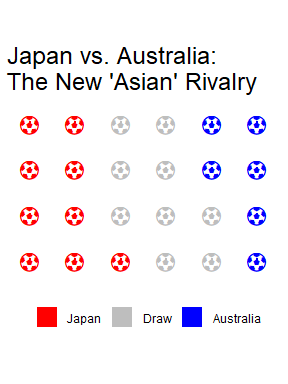

A new rival, Australia, emerged to challenge Japan in Asia as they
joined the AFC in 2006. From the come-from-behind defeat in the Group
Stages of the 2006 World Cup (still one of my most painful memories as a
Japanese football fan…) and to an extra-time win in the 2011 Asian Cup
Final, Japan and Australia have dramatically clashed in the past decade.

Using the `waffle` package I can create a graphic that summarizes the
results between the two sides.

``` r
japan_versus <- function(data, ...) {
  # filter 
  filter_vars <- enquos(...)
  
  jp_vs <- data %>% 
    filter(!!!filter_vars) %>% 
    # count results type per opponent
    group_by(result, opponent) %>% 
    mutate(n = n()) %>% 
    ungroup() %>% 
    # sum amount of goals by Japan and opponent
    group_by(result, opponent) %>% 
    summarize(j_g = sum(japan_goals),
              o_g = sum(opp_goals),
              n = n()) %>% 
    ungroup() %>% 
    # spread results over multiple columns
    spread(result, n) %>% 
    # 1. failsafe against no type of result against an opponent
    # 2. sum up counts per opponent
    group_by(opponent) %>% 
    mutate(Win = if("Win" %in% names(.)){return(Win)} else{return(0)},
         Draw = if("Draw" %in% names(.)){return(Draw)} else{return(0)},
         Loss = if("Loss" %in% names(.)){return(Loss)} else{return(0)}) %>% 
    summarize(Win = sum(Win, na.rm = TRUE),
              Draw = sum(Draw, na.rm = TRUE),
              Loss = sum(Loss, na.rm = TRUE),
              `Goals For` = sum(j_g),
              `Goals Against` = sum(o_g))
  
  return(jp_vs)
}
```

``` r
library(glue)
library(dplyr)
```

    ## 
    ## Attaching package: 'dplyr'

    ## The following object is masked from 'package:glue':
    ## 
    ##     collapse

    ## The following objects are masked from 'package:stats':
    ## 
    ##     filter, lag

    ## The following objects are masked from 'package:base':
    ## 
    ##     intersect, setdiff, setequal, union

``` r
library(tidyr)
```

    ## Warning: package 'tidyr' was built under R version 3.5.2

``` r
library(waffle)
```

    ## Loading required package: ggplot2

    ## Warning: package 'ggplot2' was built under R version 3.5.2

``` r
library(extrafont)
```

    ## Registering fonts with R

``` r
loadfonts(device = "win")
```

    ## Agency FB already registered with windowsFonts().

    ## Algerian already registered with windowsFonts().

    ## Anonymous already registered with windowsFonts().

    ## Arial Black already registered with windowsFonts().

    ## Arial already registered with windowsFonts().

    ## Arial Narrow already registered with windowsFonts().

    ## Arial Rounded MT Bold already registered with windowsFonts().

    ## Arial Unicode MS already registered with windowsFonts().

    ## Bahnschrift already registered with windowsFonts().

    ## Baskerville Old Face already registered with windowsFonts().

    ## Bauhaus 93 already registered with windowsFonts().

    ## Bell MT already registered with windowsFonts().

    ## Berlin Sans FB already registered with windowsFonts().

    ## Berlin Sans FB Demi already registered with windowsFonts().

    ## Bernard MT Condensed already registered with windowsFonts().

    ## Blackadder ITC already registered with windowsFonts().

    ## Bodoni MT already registered with windowsFonts().

    ## Bodoni MT Black already registered with windowsFonts().

    ## Bodoni MT Condensed already registered with windowsFonts().

    ## Bodoni MT Poster Compressed already registered with windowsFonts().

    ## Book Antiqua already registered with windowsFonts().

    ## Bookman Old Style already registered with windowsFonts().

    ## Bookshelf Symbol 7 already registered with windowsFonts().

    ## Bradley Hand ITC already registered with windowsFonts().

    ## Britannic Bold already registered with windowsFonts().

    ## Broadway already registered with windowsFonts().

    ## Brush Script MT already registered with windowsFonts().

    ## Calibri already registered with windowsFonts().

    ## Calibri Light already registered with windowsFonts().

    ## Californian FB already registered with windowsFonts().

    ## Calisto MT already registered with windowsFonts().

    ## Cambria already registered with windowsFonts().

    ## Candara already registered with windowsFonts().

    ## Castellar already registered with windowsFonts().

    ## Centaur already registered with windowsFonts().

    ## Century already registered with windowsFonts().

    ## Century Gothic already registered with windowsFonts().

    ## Century Schoolbook already registered with windowsFonts().

    ## Champion HTF-Heavyweight already registered with windowsFonts().

    ## Chiller already registered with windowsFonts().

    ## Colonna MT already registered with windowsFonts().

    ## Comic Sans MS already registered with windowsFonts().

    ## Consolas already registered with windowsFonts().

    ## Constantia already registered with windowsFonts().

    ## Cooper Black already registered with windowsFonts().

    ## Copperplate Gothic Bold already registered with windowsFonts().

    ## Copperplate Gothic Light already registered with windowsFonts().

    ## Corbel already registered with windowsFonts().

    ## Courier New already registered with windowsFonts().

    ## Curlz MT already registered with windowsFonts().

    ## Dubai already registered with windowsFonts().

    ## Dubai Light already registered with windowsFonts().

    ## Dubai Medium already registered with windowsFonts().

    ## Dusha V5 already registered with windowsFonts().

    ## Ebrima already registered with windowsFonts().

    ## Edwardian Script ITC already registered with windowsFonts().

    ## Elephant already registered with windowsFonts().

    ## Engravers MT already registered with windowsFonts().

    ## Eras Bold ITC already registered with windowsFonts().

    ## Eras Demi ITC already registered with windowsFonts().

    ## Eras Light ITC already registered with windowsFonts().

    ## Eras Medium ITC already registered with windowsFonts().

    ## Felix Titling already registered with windowsFonts().

    ## Fira Code already registered with windowsFonts().

    ## Fira Code Light already registered with windowsFonts().

    ## Fira Code Medium already registered with windowsFonts().

    ## Fira Code Retina already registered with windowsFonts().

    ## FontAwesome already registered with windowsFonts().

    ## Font Awesome 5 Free Regular already registered with windowsFonts().

    ## Footlight MT Light already registered with windowsFonts().

    ## Forte already registered with windowsFonts().

    ## Franklin Gothic Book already registered with windowsFonts().

    ## Franklin Gothic Demi already registered with windowsFonts().

    ## Franklin Gothic Demi Cond already registered with windowsFonts().

    ## Franklin Gothic Heavy already registered with windowsFonts().

    ## Franklin Gothic Medium already registered with windowsFonts().

    ## Franklin Gothic Medium Cond already registered with windowsFonts().

    ## Freestyle Script already registered with windowsFonts().

    ## French Script MT already registered with windowsFonts().

    ## Gabriola already registered with windowsFonts().

    ## Gadugi already registered with windowsFonts().

    ## Garamond already registered with windowsFonts().

    ## Georgia already registered with windowsFonts().

    ## Gigi already registered with windowsFonts().

    ## Gill Sans Ultra Bold already registered with windowsFonts().

    ## Gill Sans Ultra Bold Condensed already registered with windowsFonts().

    ## Gill Sans MT already registered with windowsFonts().

    ## Gill Sans MT Condensed already registered with windowsFonts().

    ## Gill Sans MT Ext Condensed Bold already registered with windowsFonts().

    ## Gloucester MT Extra Condensed already registered with windowsFonts().

    ## Goudy Old Style already registered with windowsFonts().

    ## Goudy Stout already registered with windowsFonts().

    ## Haettenschweiler already registered with windowsFonts().

    ## Harlow Solid Italic already registered with windowsFonts().

    ## Harrington already registered with windowsFonts().

    ## High Tower Text already registered with windowsFonts().

    ## HoloLens MDL2 Assets already registered with windowsFonts().

    ## HP Simplified already registered with windowsFonts().

    ## HP Simplified Light already registered with windowsFonts().

    ## Impact already registered with windowsFonts().

    ## Imprint MT Shadow already registered with windowsFonts().

    ## Informal Roman already registered with windowsFonts().

    ## Ink Free already registered with windowsFonts().

    ## IPAexGothic already registered with windowsFonts().

    ## Javanese Text already registered with windowsFonts().

    ## Jokerman already registered with windowsFonts().

    ## Juice ITC already registered with windowsFonts().

    ## Kristen ITC already registered with windowsFonts().

    ## Kunstler Script already registered with windowsFonts().

    ## Wide Latin already registered with windowsFonts().

    ## Leelawadee already registered with windowsFonts().

    ## Leelawadee UI already registered with windowsFonts().

    ## Leelawadee UI Semilight already registered with windowsFonts().

    ## Lucida Bright already registered with windowsFonts().

    ## Lucida Calligraphy already registered with windowsFonts().

    ## Lucida Console already registered with windowsFonts().

    ## Lucida Fax already registered with windowsFonts().

    ## Lucida Handwriting already registered with windowsFonts().

    ## Lucida Sans already registered with windowsFonts().

    ## Lucida Sans Typewriter already registered with windowsFonts().

    ## Lucida Sans Unicode already registered with windowsFonts().

    ## Magneto already registered with windowsFonts().

    ## Maiandra GD already registered with windowsFonts().

    ## Malgun Gothic already registered with windowsFonts().

    ## Malgun Gothic Semilight already registered with windowsFonts().

    ## Marlett already registered with windowsFonts().

    ## Matura MT Script Capitals already registered with windowsFonts().

    ## Microsoft Himalaya already registered with windowsFonts().

    ## Microsoft Yi Baiti already registered with windowsFonts().

    ## Microsoft New Tai Lue already registered with windowsFonts().

    ## Microsoft PhagsPa already registered with windowsFonts().

    ## Microsoft Sans Serif already registered with windowsFonts().

    ## Microsoft Tai Le already registered with windowsFonts().

    ## Microsoft Uighur already registered with windowsFonts().

    ## Mistral already registered with windowsFonts().

    ## Modern No. 20 already registered with windowsFonts().

    ## Mongolian Baiti already registered with windowsFonts().

    ## Monotype Corsiva already registered with windowsFonts().

    ## MS Outlook already registered with windowsFonts().

    ## MS Reference Sans Serif already registered with windowsFonts().

    ## MS Reference Specialty already registered with windowsFonts().

    ## MT Extra already registered with windowsFonts().

    ## MV Boli already registered with windowsFonts().

    ## Myanmar Text already registered with windowsFonts().

    ## Niagara Engraved already registered with windowsFonts().

    ## Niagara Solid already registered with windowsFonts().

    ## Nirmala UI already registered with windowsFonts().

    ## Nirmala UI Semilight already registered with windowsFonts().

    ## OCR A Extended already registered with windowsFonts().

    ## Old English Text MT already registered with windowsFonts().

    ## Onyx already registered with windowsFonts().

    ## Palace Script MT already registered with windowsFonts().

    ## Palatino Linotype already registered with windowsFonts().

    ## Papyrus already registered with windowsFonts().

    ## Parchment already registered with windowsFonts().

    ## Perpetua already registered with windowsFonts().

    ## Perpetua Titling MT already registered with windowsFonts().

    ## Playbill already registered with windowsFonts().

    ## Poor Richard already registered with windowsFonts().

    ## Pristina already registered with windowsFonts().

    ## Rage Italic already registered with windowsFonts().

    ## Ravie already registered with windowsFonts().

    ## Roboto Condensed already registered with windowsFonts().

    ## Roboto Condensed Light already registered with windowsFonts().

    ## Rockwell already registered with windowsFonts().

    ## Rockwell Condensed already registered with windowsFonts().

    ## Rockwell Extra Bold already registered with windowsFonts().

    ## Script MT Bold already registered with windowsFonts().

    ## Segoe MDL2 Assets already registered with windowsFonts().

    ## Segoe Print already registered with windowsFonts().

    ## Segoe Script already registered with windowsFonts().

    ## Segoe UI already registered with windowsFonts().

    ## Segoe UI Light already registered with windowsFonts().

    ## Segoe UI Semibold already registered with windowsFonts().

    ## Segoe UI Semilight already registered with windowsFonts().

    ## Segoe UI Black already registered with windowsFonts().

    ## Segoe UI Emoji already registered with windowsFonts().

    ## Segoe UI Historic already registered with windowsFonts().

    ## Segoe UI Symbol already registered with windowsFonts().

    ## Showcard Gothic already registered with windowsFonts().

    ## SimSun-ExtB already registered with windowsFonts().

    ## Snap ITC already registered with windowsFonts().

    ## Stencil already registered with windowsFonts().

    ## Sylfaen already registered with windowsFonts().

    ## Symbol already registered with windowsFonts().

    ## Tahoma already registered with windowsFonts().

    ## Tempus Sans ITC already registered with windowsFonts().

    ## Times New Roman already registered with windowsFonts().

    ## Trebuchet MS already registered with windowsFonts().

    ## Tw Cen MT already registered with windowsFonts().

    ## Tw Cen MT Condensed already registered with windowsFonts().

    ## Tw Cen MT Condensed Extra Bold already registered with windowsFonts().

    ## Verdana already registered with windowsFonts().

    ## Viner Hand ITC already registered with windowsFonts().

    ## Vivaldi already registered with windowsFonts().

    ## Vladimir Script already registered with windowsFonts().

    ## Webdings already registered with windowsFonts().

    ## Wingdings already registered with windowsFonts().

    ## Wingdings 2 already registered with windowsFonts().

    ## Wingdings 3 already registered with windowsFonts().

    ## xkcd already registered with windowsFonts().

    ## Yu Mincho Demibold already registered with windowsFonts().

    ## Yu Mincho Light already registered with windowsFonts().

    ## Yu Mincho already registered with windowsFonts().

``` r
results_jp_asia <- readRDS("../data/results_jp_asia.RDS")


jp_aus <- results_jp_asia %>% 
  japan_versus(opponent == "Australia") %>% 
  select(-opponent, Japan = Win, Australia = Loss) %>% 
  gather(key = "team", value = "values", -`Goals For`, -`Goals Against`) %>% 
  select(-contains("Goals"))

# Waffle plot!
waffle(
  jp_aus, rows = 4, size = 1, 
  title = glue("
               Japan vs. Australia: 
               The New 'Asian' Rivalry"),
  colors = c("red", "grey", "blue"), 
  use_glyph = "futbol", glyph_size = 5,
  legend_pos = "bottom"
)
```


