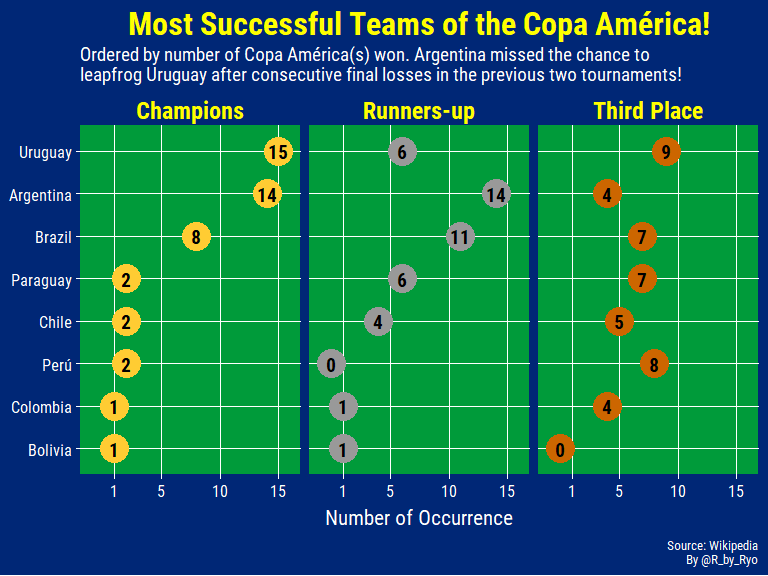
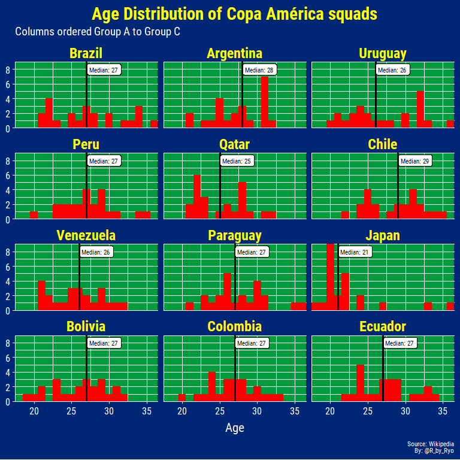
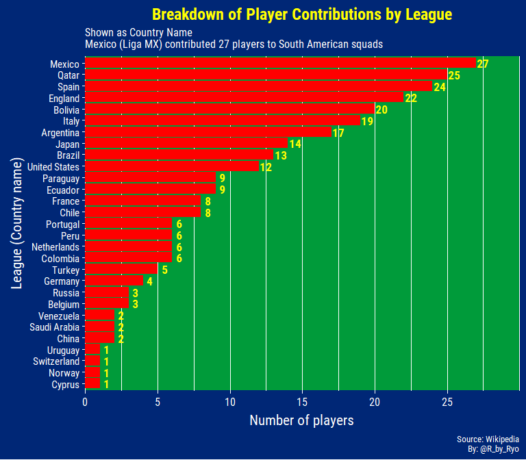
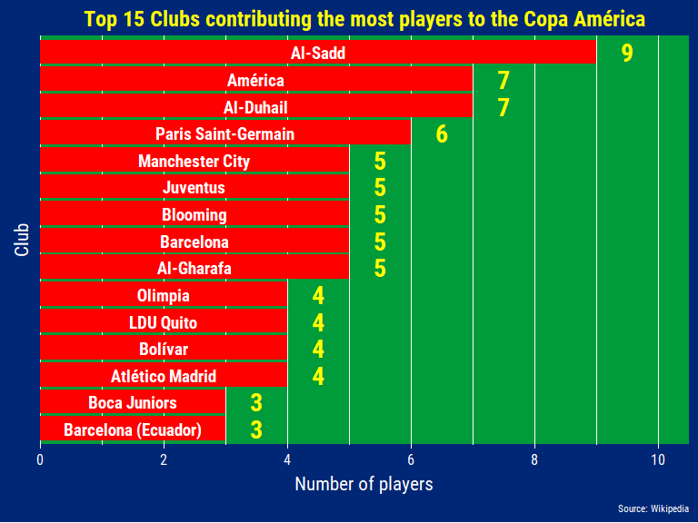
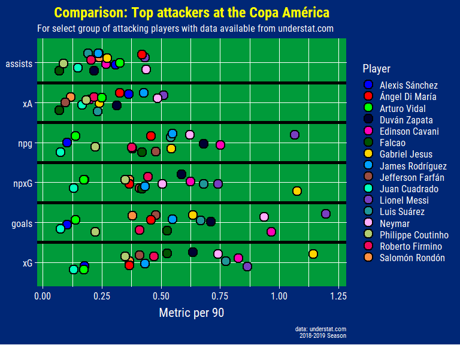
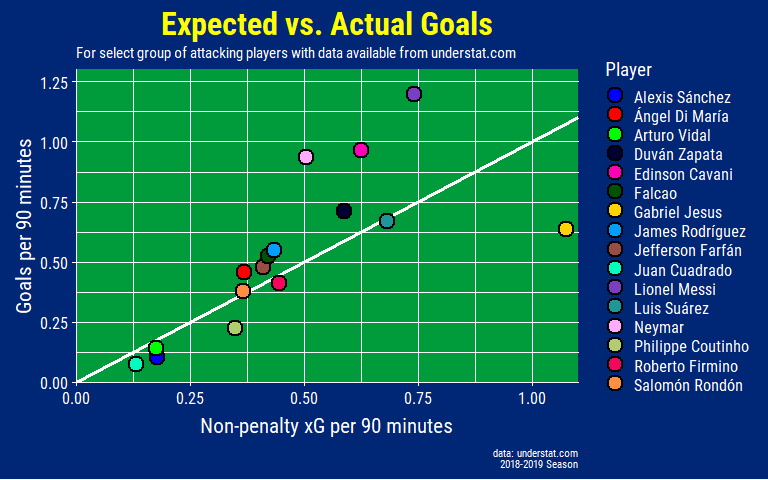
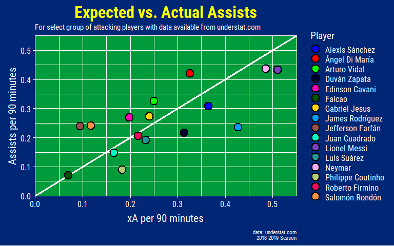
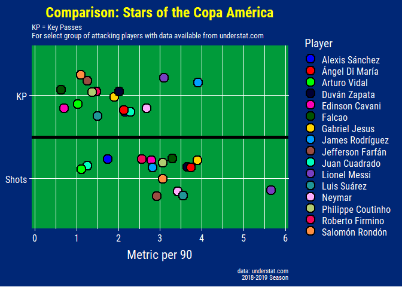
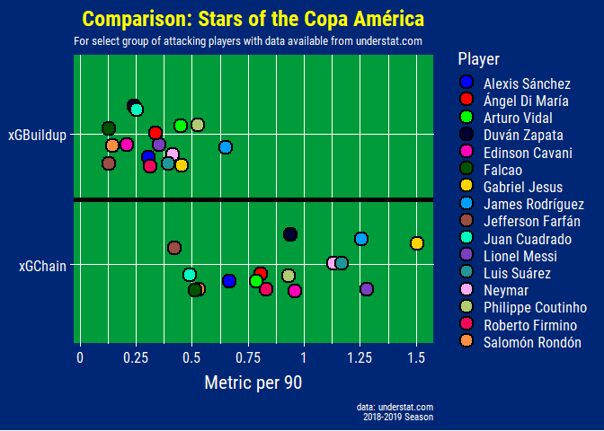
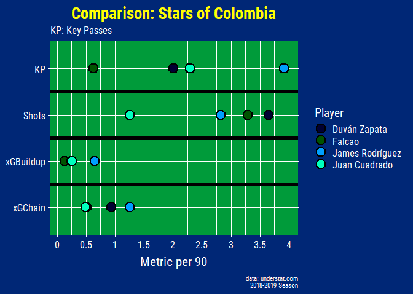

Another summer and another edition of the Copa América! Along with the
Africa Cup of Nations, Nations League finals, the Women’s World Cup,
Under-21 European Championship AND the Gold Cup this is yet another
soccer-filled season after last year’s World Cup and the Asian Cup
earlier this year (I also did a blog post on these last two tournaments
which you can see [here (World
Cup)](https://ryo-n7.github.io/2018-06-29-visualize-worldcup/) and [here
(Asian Cup)](https://ryo-n7.github.io/2019-01-11-visualize-asian-cup/)).
There is so much football going on at once even I can’t keep up,
especially with the time difference! To not redo all the previous
visualizations with Copa América data I tried to find new sources of
data and other forms of visualizations to give some insight into the
players and teams competing to be the champion of South America. You can
find all the code I used in this blogpost here and you can also find
other soccer related data viz in my
[soccer\_ggplot](https://github.com/Ryo-N7/soccer_ggplots) Github repo.

The sections will go from a very macro-level view of the **historical
records** of the tournament, to the **squads** competing, the teams’
**match record** in the Copa América, and finally to a micro-level view
of various attacking players using **xG** statistics.

¡Vámonos!

Packages
--------

``` r
library(dplyr)        ## data wrangling
library(tidyr)        ## data wrangling
library(purrr)        ## data wrangling and iteration
library(stringr)      ## data wrangling
library(rvest)        ## webscraping
library(polite)       ## webscraping (Github only pkg)
library(ggplot2)      ## plotting
library(scales)       ## plotting scales
library(ggimage)      ## images for flags
library(ggforce)      ## plotting text labels
library(cowplot)      ## plotting grid
library(glue)         ## text
library(ggrepel)      ## plotting text labels
library(magick)       ## plotting
library(DT)           ## tables
library(ggtextures)   ## soccer ball emoji as geom_col()
library(extrafont)    ## fonts: Roboto Condensed

loadfonts()
```

theme\_copaAmerica
------------------

I wanted to have all the plots in this blogpost to have a consistent
color theme. As the tournament is going to be held in Brazil, I went
with a color theme based on its flag with blue, yellow, and green being
the primary colors.

``` r
theme_copaAmerica <- function(
  title.size = 24,
  subtitle.size = 14,
  caption.size = 8,
  axis.text.size = 14,
  axis.text.x.size = 12,
  axis.text.y.size = 12,
  axis.title.size = 16,
  strip.text.size = 18,
  panel.grid.major.x = element_line(size = 0.5, color = "white"),
  panel.grid.major.y = element_line(size = 0.5, color = "white"),
  panel.grid.minor.x = element_blank(),
  panel.grid.minor.y = element_blank(),
  axis.ticks = element_line(color = "white")) {
  ## Theme:
  theme(text = element_text(family = "Roboto Condensed", color = "white"),
        plot.title = element_text(family = "Roboto Condensed", face = "bold", 
                                  size = title.size, color = "yellow"),
        plot.subtitle = element_text(size = subtitle.size),
        plot.caption = element_text(size = caption.size),
        panel.background = element_rect(fill = "#009b3a"),
        plot.background = element_rect(fill = "#002776"),
        axis.text = element_text(size = axis.text.size, color = "white"),
        axis.text.x = element_text(size = axis.text.x.size, color = "white"),
        axis.text.y = element_text(size = axis.text.y.size, color = "white"),
        axis.title = element_text(size = axis.title.size),
        axis.line.x = element_blank(),
        axis.line.y = element_blank(),
        panel.grid.major.x = panel.grid.major.x,
        panel.grid.major.y = panel.grid.major.y,
        panel.grid.minor.x = panel.grid.minor.x,
        panel.grid.minor.y = panel.grid.minor.y,
        strip.text = element_text(color = "yellow", face = "bold", 
                                  size = strip.text.size, 
                                  margin = margin(4.4, 4.4, 4.4, 4.4)),
        strip.background = element_blank(),
        axis.ticks = axis.ticks
        )
}
```

Top Goal Scorers // Goleadores
------------------------------

For this plot I took the stats from the Spanish version of the Wikipedia
page as it had more content. I used `purrr::flatten_df()` to squish the
list output into a dataframe then set the names of each column using
`purrr::set_names()`.

``` r
url <- "https://es.wikipedia.org/wiki/Anexo:Estad%C3%ADsticas_de_la_Copa_Am%C3%A9rica"

session <- bow(url)

copa_top_scorers <- scrape(session) %>% 
  html_nodes(".mw-parser-output > table:nth-child(95)") %>% 
  html_table() %>% 
  flatten_df() %>% 
  set_names(c("player", "country", "goals")) %>% 
  mutate(image = "https://www.emoji.co.uk/files/microsoft-emojis/activity-windows10/8356-soccer-ball.png")
```

``` r
glimpse(copa_top_scorers)
```

    ## Observations: 22
    ## Variables: 4
    ## $ player  <chr> "Norberto Méndez", "Zizinho", "Lolo Fernández", "Sever...
    ## $ country <chr> "ARG Argentina", "BRA Brasil", "PER Perú", "URU Urugua...
    ## $ goals   <int> 17, 17, 15, 15, 13, 13, 13, 13, 13, 12, 12, 11, 11, 11...
    ## $ image   <chr> "https://www.emoji.co.uk/files/microsoft-emojis/activi...

Like in the Asian Cup blogpost I use [Claus
Wilke](https://twitter.com/ClausWilke/)’s
[ggtextures](https://github.com/clauswilke/ggtextures) package to use
**soccer ball emoji** as the column image in the plot.

``` r
copa_goleadores_raw_plot <- copa_top_scorers %>% 
  head(5) %>% 
  ggplot(aes(x = reorder(player, goals), y = goals,
             image = image)) +
  geom_isotype_col(img_width = grid::unit(1, "native"), img_height = NULL,
    ncol = NA, nrow = 1, hjust = 0, vjust = 0.5) +
  geom_text(aes(label = goals, family = "Roboto Condensed", fontface = "bold"), 
            size = 7.5, color = "yellow",
            nudge_y = 0.5) +
  coord_flip() +
  scale_y_continuous(breaks = c(0, 2, 4, 6, 8, 10, 12, 14, 16, 18),
                     expand = c(0, 0), 
                     limits = c(0, 19)) +
  labs(title = "Top Scorers of the Copa América",
       subtitle = glue("
                       Most goals in a single tournament: 9 
                       Humberto Maschio (Argentina), Javier Ambrois (Uruguay), Jair (Brazil)"),
       y = "Number of Goals", x = NULL,
       caption = glue("
                      Source: Wikipedia
                      By @R_by_Ryo")) +
  theme_copaAmerica(title.size = 26,
                    subtitle.size = 16,
                    caption.size = 12,
                    axis.text.size = 18,
                    axis.title.size = 18,
                    panel.grid.major.y = element_blank(),
                    axis.ticks = element_blank())

## Add flags to y-axis:
axis_image <- axis_canvas(copa_goleadores_raw_plot, axis = 'y') + 
  draw_image("https://upload.wikimedia.org/wikipedia/en/0/05/Flag_of_Brazil.svg", 
             y = 16.5, scale = 1.8) +
  draw_image("https://upload.wikimedia.org/wikipedia/commons/1/1a/Flag_of_Argentina.svg", 
             y = 12.5, scale = 1.8) +
  draw_image("https://upload.wikimedia.org/wikipedia/commons/f/fe/Flag_of_Uruguay.svg", 
             y = 9, scale = 1.8) +
  draw_image("https://upload.wikimedia.org/wikipedia/commons/d/df/Flag_of_Peru_%28state%29.svg", 
             y = 5.25, scale = 1.8) +
  draw_image("https://upload.wikimedia.org/wikipedia/en/0/05/Flag_of_Brazil.svg", 
             y = 1.5, scale = 1.8)

copa_goleadores_plot <- ggdraw(insert_yaxis_grob(copa_goleadores_raw_plot, axis_image, position = "left"))
copa_goleadores_plot
```


Most of these players aren’t ones you might recognize. The Copa América
used to be held a lot more regularly (and sometimes erratically) until
this century so players had a lot more opportunities to score goals. All
five of the players you see here played in the 1930s-1950s when there
was a tournament every one or two years. Out of currently active
players, Peruvian legend Paolo Guerrero has 11 goals along with Eduardo
Vargas (from Chile). (Edit: after the Chile - Japan game, Vargas is on
12…) Another player you might recognize that was actually tied with
Ademir for 5th place, along with three other players, was Gabriel
Batistuta (“Batigol”).

Winners of the Copa América
---------------------------

After grabbing the data from the Wikipedia page I used a variety of
functions to clean and reshape the dataset like `tidyr::separate()` to
split the number of occurences and the year.

``` r
url <- "https://es.wikipedia.org/wiki/Anexo:Estad%C3%ADsticas_de_la_Copa_Am%C3%A9rica"

session <- bow(url)

copa_campeones <- scrape(session) %>% 
  html_nodes(".mw-parser-output > table:nth-child(10)") %>% 
  html_table() %>% 
  flatten_df()

copa_campeones_limpia <- copa_campeones %>% 
  janitor::clean_names() %>% 
  slice(1:8) %>% 
  select(1:4) %>% 
  set_names(c("team", "winners", "runners_up", "third_place")) %>% 
  separate(winners, into = c("Champions", "first_place_year"), 
           sep = " ", extra = "merge") %>% 
  separate(runners_up, into = c("Runners-up", "second_place_year"), 
           sep = " ", extra = "merge") %>% 
  separate(third_place, into = c("Third Place", "third_place_year"), 
           sep = " ", extra = "merge") %>% 
  mutate_all(list(~str_replace_all(., "–", "0"))) %>% 
  mutate_at(vars(contains("num")), funs(as.numeric)) %>% 
  gather(key = "key", value = "value", -team, 
         -first_place_year, -second_place_year, -third_place_year) %>% 
  mutate(key = as.factor(key),
         value = as.numeric(value),
         team = team %>% str_replace(., "[A-Z]{3}", "") %>% str_trim(.),
         team = case_when(team == "Brasil" ~ "Brazil",
                          TRUE ~ team)) %>% 
  mutate(key = forcats::fct_relevel(key, 
                                    "Champions",
                                    "Runners-up",
                                    "Third Place")) %>% 
  arrange(key, desc(value)) %>% 
  mutate(team = forcats::as_factor(team),
         order = row_number())
```

I also wanted to add flags to this plot but
`cowplot::insert_yaxis_grob()` is unfortunately not compatible with
facets. I used `stringr::str_wrap()` to format the subtitle nicely while
I used `glue::glue()` to avoid having the use ‘’ to create a new line
for the caption.

``` r
copa_ganadores_plot <- copa_campeones_limpia %>% 
  ggplot(aes(value, forcats::fct_rev(team), color = key)) +
  geom_point(size = 10) +        # 10
  geom_text(aes(label = value), 
            size = 5, color = "black",    # 5 
            family = "Roboto Condensed", fontface = "bold") +
  scale_color_manual(values = c("Champions" = "#FFCC33",
                                "Runners-up" = "#999999",
                                "Third Place" = "#CC6600"),
                     guide = FALSE) +
  scale_x_continuous(breaks = c(1, 5, 10, 15),
                     labels = c(1, 5, 10, 15),
                     limits = c(-1, 16)) +
  labs(x = "Number of Occurrence", y = NULL,
       title = "Most Successful Teams of the Copa América!",
       subtitle = str_wrap("Ordered by number of Copa América(s) won. Argentina missed the chance to leapfrog Uruguay after consecutive final losses in the previous two tournaments!", width = 80),
       caption = glue("
                      Source: Wikipedia
                      By @R_by_Ryo")) +
  facet_wrap(~key) +
  theme_copaAmerica(subtitle.size = 14, 
                    caption.size = 10)

copa_ganadores_plot
```



What’s surprising to note is that Pele never won a Copa América with
Brazil, although he did get Best Player and Top Scorer in the 1959
edition of the tournament. Even more bizarrely Diego Maradona has never
won it either! He didn’t play in either of the 1991 and 1993 editions
where Argentina won their 13th and 14th Copas.

Copa América Squad Profiles
---------------------------

We just looked at what happened in the past but who are the players
competing in the tournament this year? To take a quick look I
web-scraped the squads of each of the competing teams from Wikipedia.

I created a list of the `xpath`s for each of squads and using
`purrr::map()` I grabbed the data for each participating country. After
I got some meta-information about the country name and the group I
created a list-column that stores the squad data as a dataframe in its
own column. To explode this out I used `tidyr::unnest()` to reshape the
entire dataframe to have one row with all the data for each player in
every squad.

To get a clean dataset I use some `stringr::str_*()` functions to
properly format the character strings such as the player positions,
ages, date of births.

``` r
squads_df_clean <- squads_df_raw %>% 
  janitor::clean_names() %>% 
  select(-delete, squad_num = no, 
         position = pos, birth_age = date_of_birth_age) %>% 
  mutate(position = position %>% str_replace_all(., "[1-9]", ""),
         birth_age = birth_age %>% str_extract_all(., pattern = "\\([^()]+\\)")) %>%   unnest(birth_age) %>% 
  group_by(player) %>% 
  mutate(colnum = seq_along(player)) %>% 
  spread(key = colnum, value = birth_age) %>% 
  ungroup() %>% 
  select(everything(), dob = `1`, age = `2`) %>% 
  mutate(dob = dob %>% str_replace_all(., "[()]", "") %>% lubridate::as_date(),
         age = age %>% str_extract(., "[0-9]+") %>% as.integer,
         country = forcats::fct_relevel(country, 
                                    "Brazil", "Argentina", "Uruguay", 
                                    "Peru", "Qatar", "Chile",  
                                    "Venezuela", "Paraguay", "Japan", 
                                    "Bolivia", "Colombia", "Ecuador",
                                    ),
         club = case_when(
           club == "Barcelona" & country == "Ecuador" ~ "Barcelona (Ecuador)",
           TRUE ~ club))
```

``` r
glimpse(squads_df_clean)
```

    ## Observations: 276
    ## Variables: 12
    ## $ name           <int> 3, 3, 3, 3, 3, 3, 3, 3, 3, 3, 3, 3, 3, 3, 3, 3,...
    ## $ group          <chr> "A", "A", "A", "A", "A", "A", "A", "A", "A", "A...
    ## $ country        <fct> Brazil, Brazil, Brazil, Brazil, Brazil, Brazil,...
    ## $ squad_num      <int> 1, 2, 3, 4, 5, 6, 7, 8, 9, 10, 11, 12, 13, 14, ...
    ## $ position       <chr> "GK", "DF", "DF", "DF", "MF", "DF", "FW", "MF",...
    ## $ player         <chr> "Alisson", "Thiago Silva", "Miranda", "Marquinh...
    ## $ caps           <int> 36, 79, 57, 36, 36, 40, 3, 10, 29, 65, 49, 15, ...
    ## $ goals          <int> 0, 7, 3, 1, 0, 2, 1, 0, 16, 8, 14, 1, 7, 0, 0, ...
    ## $ club           <chr> "Liverpool", "Paris Saint-Germain", "Internazio...
    ## $ country_league <chr> "England", "France", "Italy", "France", "Spain"...
    ## $ dob            <date> 1992-10-02, 1984-09-22, 1984-09-07, 1994-05-14...
    ## $ age            <int> 26, 34, 34, 25, 27, 33, 22, 22, 22, 30, 27, 28,...

### Age-histogram

Using this data I can plot a bunch of histograms:

``` r
age_country_plot <- squads_df_clean %>% 
  group_by(country) %>% 
  mutate(median_age = median(age)) %>% 
  ungroup() %>% 
  ggplot(aes(x = age)) +
  geom_histogram(fill = "red", binwidth = 1) +
  geom_vline(aes(xintercept = median_age), size = 1.2) +
  geom_label(aes(x = median_age, y = 8, 
                label = glue::glue("Median: {median_age}")),
            nudge_x = 0.5, hjust = 0.1, size = 3,
            family = "Roboto Condensed", color = "black") +
  labs(title = "Age Distribution of Copa América squads",
       subtitle = "Columns ordered Group A to Group C",
       x = "Age", y = NULL,
       caption = glue::glue("
                            Source: Wikipedia
                            By: @R_by_Ryo")) +
  scale_x_continuous(expand = c(0, 0)) +
  scale_y_continuous(expand = c(0, 0),
                     breaks = scales::pretty_breaks()) +
  theme_copaAmerica(title.size = 22,
                    subtitle.size = 14, 
                    caption.size = 8,
                    axis.text.size = 12,
                    axis.title.size = 16,
                    strip.text.size = 18,
                    panel.grid.minor.x = element_line(color = "white"),
                    panel.grid.minor.y = element_line(color = "white")) +
  facet_wrap(~country, ncol = 3)
  
age_country_plot
```



In terms of age, Japan have the youngest team with a median of 21, 4
years younger than the next youngest team, Qatar. The rest have a fairly
balanced spread of ages from 20 to early-mid 30s with most of the
medians hovering around 27 years of age. The reason for Japan’s
extremely young squad is due to the fact that the full-strength Japan
team has played in both the World Cup and the Asian Cup in the past
year. Along with the fact that the Tokyo Olympics are next year, it was
decided to use the invitation to the Copa América as a trial-by-fire for
the young stars of the future. Much like in a real Olympic squad, the
team contains three “overage” players in World Cup 2010/2014/2018
goalkeeper Eiji Kawashima, Premier League winner Shinji Okazaki, and
Getafe playmaker Gaku Shibasaki.

The oldest player will be Brazil captain Dani Alves at 36 with
Paraguay’s Oscar Cardozo only two weeks younger. On the other hand, the
youngest player is Japan’s 18-year old prodigy Takefusa Kubo, the
ex-Barcelona youth player who only just recently moved to Real Madrid!
In light of his transfer a lot of eyes will be on him to see if he can
produce some Captain Tsubasa-esque performances for a very inexperienced
Japan team gearing up for the Tokyo Olympics!

### Caps histogram

When considering the experience of a squad it’s not enough to look at
ages but one needs to look at the caps or appearances for the national
team as well.

``` r
caps_country_plot <- squads_df_clean %>% 
  group_by(country) %>% 
  mutate(median_cap = median(caps)) %>% 
  ungroup() %>% 
  ggplot(aes(x = caps)) +
  geom_histogram(fill = "red", binwidth = 5) +
  geom_vline(aes(xintercept = median_cap), size = 1.25) +
  geom_label(aes(x = median_cap, y = 15, 
                label = glue::glue("Median: {median_cap}")),
            nudge_x = 0.5, hjust = 0.05, size = 3,
            family = "Roboto Condensed", color = "black") +
  labs(title = "Caps (Appearances) by Country", 
       subtitle = "Columns ordered Group A to Group C",
       x = "Caps", y = NULL,
       caption = glue::glue("
                            Source: Wikipedia
                            By: @R_by_Ryo")) +
  scale_x_continuous(expand = c(0, 0)) +
  scale_y_continuous(expand = c(0, 0)) +
  theme_copaAmerica(
    title.size = 20,
    subtitle.size = 14, 
    caption.size = 10,
    axis.text.size = 10,
    axis.title.size = 16,
    strip.text.size = 18,
    panel.grid.major.x = element_line(color = "white", size = 0.25),
    panel.grid.major.y = element_line(color = "white", size = 0.25),
    panel.grid.minor.x = element_line(color = "white", size = 0.25),
    panel.grid.minor.y = element_line(color = "white", size = 0.25)) +
  facet_wrap(~country, ncol = 3)

caps_country_plot
```


The majority of Japan’s squad have 0 (ZERO) caps, with the
aforementioned three “overage” players taking up most of the proportion
of caps on the team. Bolivia are also taking a untested squad with 8 of
their players with 2 caps or less! Chile, Uruguay, and Argentina bring
their veterans with multiple players over or around 100 caps. From this
data I was surprised that Jefferson Farfan and Paolo Guerrero didn’t
have 100 caps by now…

The player with the most caps is Lionel Messi (130) followed closely by
Diego Godin (126), and Alexis Sanchez (124). On the other hand there are
29 players hopeful of making their first national team appearance at
this tournament with the majority (17 players) coming from Japan.

### Goal distribution

Next I looked at the distribution of goals scored by the midfielders and
strikers of each team. I found out about using
`ggplot2::position_nudge()` for slightly adjusting variables on a
discrete scale in similar fashion to the `nudge_y =` and `nudge_x =`
arguments most people might be familiar with from other geoms. I also
used `ggforce::geom_mark_hull()` to do some labelling.

``` r
goals_country_plot <- squads_df_clean %>% 
  filter(position %in% c("MF", "FW")) %>% 
  group_by(country) %>% 
  mutate(median = median(goals)) %>% 
  ungroup() %>% 
  ggplot(aes(x = goals, y = reorder(country, median))) +
  ggridges::geom_density_ridges(fill = "red", color = "white", scale = 1.1) +
  geom_point(aes(x = median, y = country), position = position_nudge(y = 0.25),
             color = "yellow", size = 3) +
  ggforce::geom_mark_hull(aes(filter = country == "Argentina" & goals == 67, label = "Lionel Messi: 67 goals"),
                          label.buffer = unit(15, "mm"), label.fontsize = 10, label.fill = "red",
                          label.family = "Roboto Condensed", label.colour = "white",
                          con.cap = unit(1, "mm"), con.type = "straight") +
  ggforce::geom_mark_hull(aes(filter = country == "Uruguay" & goals == 55, label = "Luis Suarez: 55 goals"),
                          label.buffer = unit(5, "mm"), label.fontsize = 10, label.fill = "red",
                          label.family = "Roboto Condensed", label.colour = "white",
                          con.cap = unit(1, "mm"), con.type = "straight") +
  ggforce::geom_mark_hull(aes(filter = country == "Japan" & goals == 50, label = "Shinji Okazaki: 50 goals"),
                          label.buffer = unit(2, "mm"), label.fontsize = 10, label.fill = "red",
                          label.family = "Roboto Condensed", label.colour = "white",
                          con.cap = unit(1, "mm"), con.type = "straight") +
  ggforce::geom_mark_hull(aes(filter = country == "Uruguay" & goals == 46, label = "Edinson Cavani: 46 goals"),
                          label.buffer = unit(25, "mm"), label.fontsize = 10, label.fill = "red",
                          label.family = "Roboto Condensed", label.colour = "white",
                          con.cap = unit(1, "mm"), con.type = "straight") +
  ggforce::geom_mark_hull(aes(filter = country == "Chile" & goals == 41, label = "Alexis Sanchez: 41 goals"),
                          label.buffer = unit(4, "mm"), label.fontsize = 10, label.fill = "red",
                          label.family = "Roboto Condensed", label.colour = "white",
                          con.cap = unit(1, "mm"), con.type = "straight") +
  scale_x_continuous(limits = c(0, 73),
                     expand = c(0.01, 0.01),
                     breaks = c(0, 5, 10, 15, 20, 25, 30, 35, 40, 45, 50, 55, 60, 65, 70),
                     labels = c(0, 5, 10, 15, 20, 25, 30, 35, 40, 45, 50, 55, 60, 65, 70)) +
  expand_limits(y = 13.5) +
  labs(title = "Distribution of Goals Scored by Midfielders and Strikers",
       subtitle = "Copa América 2019 squads, Yellow dot = Median goals",
       x = "Goals", y = NULL,
       caption = glue::glue("
                            Source: Wikipedia
                            Data from prior to start of tournament
                            By: @R_by_Ryo")) +
  theme_copaAmerica(title.size = 18,
                    subtitle.size = 12, 
                    caption.size = 8,
                    axis.text.size = 14,
                    axis.title.size = 16,
                    strip.text.size = 18) 

goals_country_plot
```

    ## Picking joint bandwidth of 2.07


With a lot of these players being more defensively minded or new players
the distribution is heavily skewed but you can see little mounds showing
the top goalscorers for each country and see which countries have their
goalscorers spread out among multiple players such as Brazil, Qatar, and
Peru.

If you know your South American players you can take a good guess at who
are the top goal scorers for each nation. For Colombia the two outlying
mounds are obviously James Rodriguez and Falcao, for example.
Venezuela’s top scorer with 22 is Salomon Rondon and for Brazil, if not
for his injury, a lonesome mound would have appeared for Neymar with 60
goals!

### Player contribution by league

Now let’s check the player contribution to the squads at the Copa
América by league. I’m just going to use the country that the league is
from for simplicity’s sake. Originally I wanted to `left_join()` it with
a ‘country &lt;&gt; domestic league’ table but couldn’t find one and the
league names itself aren’t very meaningful or have awful sponsor names
that obfuscate the country of origin even further.

``` r
player_contrib_league_plot <- squads_df_clean %>% 
  group_by(country_league) %>%
  summarize(n = n()) %>%
  ungroup() %>% 
  ggplot(aes(y = n, x = reorder(country_league, n))) +
  geom_col(fill = "red") +
  geom_text(aes(label = n, family = "Roboto Condensed", fontface = "bold"), 
            size = 4.5, color = "yellow",
            nudge_y = 0.5) +
  coord_flip() +
  scale_y_continuous(labels = c(0, 5, 10, 15, 20, 25),
                     breaks = c(0, 5, 10, 15, 20, 25),
                     limits = c(0, 30),
                     expand = c(0, 0)) +
  labs(title = "Breakdown of Player Contributions by League",
       subtitle = glue("
                       Shown as Country Name 
                       Mexico (Liga MX) contributed 27 players to South American squads"),
       x = "League (Country name)", y = "Number of players",
       caption = glue::glue("
                            Source: Wikipedia
                            By: @R_by_Ryo")) +
  theme_copaAmerica(title.size = 18,
                    subtitle.size = 12,
                    caption.size = 10, 
                    axis.text.size = 14,
                    axis.text.y.size = 11,
                    axis.title.size = 16,
                    panel.grid.major.y = element_blank(),
                    panel.grid.minor.x = element_line(color = "white"))

player_contrib_league_plot
```



The best of the best players from South American countries will move on
to Europe so the Argentinean league (Superliga Argentina) and the
Brazilian league (Brasileirão - Serie A) do not have as many players as
you might think and as a consequence, the top leagues of England, Spain,
and Italy contribute quite a bit! A lot of the better players but not
quite elite South American players might go to Mexico instead of a
lower-mid European league. With the growth of the MLS a fair number of
players ply their trade there as well.

We can take a more detailed look by creating a table of the proportion
of players from each squad coming from either a domestic league or any
other league. I had to do a lot of wrangling to get the proper output
for the table. After calculating the percentage of domestic players from
a country’s domestic league I added the full data back in. Then I had to
make sure that for each country, the country - domestic league country
was the first row in each of the country groups (so Bolivia - Bolivia,
Bolivia, China, Japan - Japan, Japan - England, etc.). By doing this I
can automatically `tidyr::fill()`-in the rest of the rows of that
country with the ‘percentage of players from domestic league stat’.

``` r
squads_df_clean %>% 
  group_by(country, country_league) %>% 
  summarize(player_from_league = n()) %>% 
  filter(country == country_league) %>% 
  mutate(perc_from_domestic_league = percent(player_from_league / 23, accuracy = 0.1)) %>% 
  right_join(squads_df_clean %>% 
              group_by(country, country_league) %>% 
              summarize(player_from_league = n()) %>% 
              ungroup()) %>% 
  mutate(first = case_when(
    country == country_league ~ 1,
    TRUE ~ 0)) %>% 
  arrange(country, desc(first)) %>% 
  fill(perc_from_domestic_league) %>% 
  group_by(country) %>% 
  mutate(perc_from_league = percent(player_from_league / 23, accuracy = 0.1),
         country_league = glue::glue("{country_league} - league")) %>% 
  arrange(desc(player_from_league)) %>% 
  select(Country = country, `League (country name)` = country_league,
         `Number of players from league` = player_from_league,
         `Percentage of players from league` = perc_from_league,
         `Percentage of players from domestic league` = perc_from_domestic_league) %>% 
  DT::datatable(rownames = FALSE)
```

    ## Joining, by = c("country", "country_league", "player_from_league")

    ## Warning in mutate_impl(.data, dots, caller_env()): Vectorizing 'glue'
    ## elements may not preserve their attributes

    ## Warning in mutate_impl(.data, dots, caller_env()): Vectorizing 'glue'
    ## elements may not preserve their attributes

    ## Warning in mutate_impl(.data, dots, caller_env()): Vectorizing 'glue'
    ## elements may not preserve their attributes

    ## Warning in mutate_impl(.data, dots, caller_env()): Vectorizing 'glue'
    ## elements may not preserve their attributes

    ## Warning in mutate_impl(.data, dots, caller_env()): Vectorizing 'glue'
    ## elements may not preserve their attributes

    ## Warning in mutate_impl(.data, dots, caller_env()): Vectorizing 'glue'
    ## elements may not preserve their attributes

    ## Warning in mutate_impl(.data, dots, caller_env()): Vectorizing 'glue'
    ## elements may not preserve their attributes

    ## Warning in mutate_impl(.data, dots, caller_env()): Vectorizing 'glue'
    ## elements may not preserve their attributes

    ## Warning in mutate_impl(.data, dots, caller_env()): Vectorizing 'glue'
    ## elements may not preserve their attributes

    ## Warning in mutate_impl(.data, dots, caller_env()): Vectorizing 'glue'
    ## elements may not preserve their attributes

    ## Warning in mutate_impl(.data, dots, caller_env()): Vectorizing 'glue'
    ## elements may not preserve their attributes

    ## Warning in mutate_impl(.data, dots, caller_env()): Vectorizing 'glue'
    ## elements may not preserve their attributes


Three interesting facts I found:

-   30% of players on the Brazil squad play for an English team, most
    out of any league - squad combination excluding domestic leagues.
-   100% of the Qatar squad play in their domestic league!
-   Only one Uruguayan player (4.3%) plays in its domestic league.

### Player contribution by club

In the final plot for this section, I looked at the top 10 clubs
contributing the most players to the tournament. I used
`arrange(desc(n)) %>% slice()` instead of `top_n()` as there were too
many teams tied at 4 players. To set the team names inside the bars I
created a midpoint value `midval` that calculated a value half of the
number of players contributed so the labels were placed neatly.

``` r
player_contrib_club_plot <- squads_df_clean %>% 
  group_by(club) %>% 
  summarize(n = n()) %>% 
  mutate(club = club %>% forcats::as_factor() %>% forcats::fct_reorder(n),
         midval = n / 2) %>% 
  arrange(desc(n)) %>% 
  slice(1:15) %>% 
  ggplot(aes(x = club, y = n)) +
  geom_col(fill = "red") +
  geom_text(aes(label = n, family = "Roboto Condensed", fontface = "bold"), 
            size = 7.5, color = "yellow",
            nudge_y = 0.5) +
  geom_text(aes(y = midval, label = club, 
                family = "Roboto Condensed", fontface = "bold"),
            size = 5, color = "white") +
  coord_flip() +
  scale_y_continuous(breaks = scales::pretty_breaks(),
                     expand = c(0, 0),
                     limits = c(0, 10.5)) +
  labs(title = "Top 15 Clubs contributing the most players to the Copa América",
       x = "Club", y = "Number of players",
       caption = "Source: Wikipedia") +
  theme_copaAmerica(
    title.size = 18,
    subtitle.size = 12, 
    caption.size = 8,
    axis.text.size = 14,
    axis.title.size = 16,
    strip.text.size = 18,
    panel.grid.major.y = element_blank(),
    panel.grid.minor.x = element_line(color = "white")) +
  theme(axis.text.y = element_blank(),
        axis.ticks.y = element_blank())

player_contrib_club_plot
```



With 100% of its players coming from the domestic league it’s not
surprise that the Qatari team, Al-Sadd, is contributing the most players
to the tournament. Tied with another Qatari team, Mexican club America
features 7 players yet none of them are Mexicans (2 Argentineans, 2
Colombians, 1 Ecuadorian, 1 Chilean, and 1 Paraguayan).

At first I thought Barcelona contributed 8 players until I realized the
Ecuadorian players were coming from the Ecuadorian team called
Barcelona…I had to go all the way back up to the beginning of this
section to fix that small peculiarity. As futbol came to South America
via European colonists and immigrants a lot of teams took up the names
and colors of the teams these Europeans were fond of. Other examples
include Liverpool F.C. (Montevideo, Uruguay), Arsenal de Sarandi (Buenos
Aires, Argentina), and Club Atletico Juventus (Sao Paulo, Brazil -
although they use the colors of Torino F.C.).

If you download the data and type in the code below you can see the
entire club-country list.

``` r
squads_df_clean %>% 
    group_by(club, country) %>% 
    summarize(n = n()) %>% View()
```

Match Records
-------------

Now that we got a good look at the composition of the teams, we can take
a look at how they’ve done at every Copa América.

The next code chunk mainly comes from PH Julien and his excellent Kaggle
kernel of [“A Journey Through The History of
Soccer”](https://www.kaggle.com/phjulien/a-journey-through-the-history-of-soccer/).

``` r
## grab football federation affiliations data
federation_files <- Sys.glob("../data/federation_affiliations/*")

df_federations = data.frame(country = NULL, federation = NULL)
for (f in federation_files) {
    federation = basename(f)
    content = read.csv(f, header=FALSE)
    content <- cbind(content,federation=rep(federation, dim(content)[1]))
    df_federations <- rbind(df_federations, content)
}

colnames(df_federations) <- c("country", "federation")

df_federations <- df_federations %>% 
  mutate(country = as.character(country) %>% str_trim(side = "both"))

results_raw <- readr::read_csv("../data/results.csv")

results_copa <- results_raw %>% 
  filter(tournament == "Copa América") %>% 
  rename(venue_country = country, 
         venue_city = city) %>% 
  mutate(match_num = row_number())

## combine with federation affiliations
results_copa_home <- results_copa %>% 
  left_join(df_federations, 
            by = c("home_team" = "country")) %>% 
  mutate(federation = as.character(federation)) %>% 
  rename(home_federation = federation) 

results_copa_away <- results_copa %>% 
  left_join(df_federations, 
            by = c("away_team" = "country")) %>% 
  mutate(federation = as.character(federation)) %>% 
  rename(away_federation = federation)

## combine home-away
results_copa_cleaned <- results_copa_home %>% 
  full_join(results_copa_away)
```

Unfortunately, this data does not have **penalty** results as those
games are all counted as a draw (as technically that is the actual
result). Considering there a lot of cagey knock-out rounds that finish
in a penalty shoot-out (including the last two finals…) it is
unfortunate but that’s just the data you have sometimes. There is a way
to web-scrape all the Copa América results and assign Win-Lose to those
games that went to penalties but I’ll leave that for another time. Also,
there is no info on what stage of the tournament the match recorded is
in.

``` r
results_copa_cleaned <- results_copa_cleaned %>% 
  mutate(
    home_federation = case_when(
      home_team == "USA" ~ "Concacaf",
      TRUE ~ home_federation),
    away_federation = case_when(
      away_team == "USA" ~ "Concacaf",
      TRUE ~ away_federation)) %>% 
  select(-contains("federation"), -contains("venue"),
         -neutral, date, home_team, home_score, away_team, away_score, 
         tournament, venue_city)
```

``` r
glimpse(results_copa_cleaned)
```

    ## Observations: 787
    ## Variables: 8
    ## $ date       <date> 1916-07-02, 1916-07-06, 1916-07-08, 1916-07-10, 19...
    ## $ home_team  <chr> "Chile", "Argentina", "Brazil", "Argentina", "Brazi...
    ## $ away_team  <chr> "Uruguay", "Chile", "Chile", "Brazil", "Uruguay", "...
    ## $ home_score <dbl> 0, 6, 1, 1, 1, 0, 4, 4, 1, 4, 5, 1, 6, 2, 0, 3, 4, ...
    ## $ away_score <dbl> 4, 1, 1, 1, 2, 0, 0, 2, 0, 0, 0, 0, 0, 3, 2, 1, 1, ...
    ## $ tournament <chr> "Copa América", "Copa América", "Copa América", "Co...
    ## $ match_num  <int> 1, 2, 3, 4, 5, 6, 7, 8, 9, 10, 11, 12, 13, 14, 15, ...
    ## $ venue_city <chr> "Buenos Aires", "Buenos Aires", "Buenos Aires", "Bu...

Now that it’s nice and cleaned up I created a function that reshapes the
data so that it’s set from a certain team’s perspective with the “team”
argument. You can also set the function to look for only results against
a certain opponent by filling in the `versus` argument.

``` r
copaAmerica_resultados <- function(data, team, versus = NA) {
  
  ## team of interest: ex. 'Brazil'
  team_var <- enquo(team)
  
  todos_partidos <- data %>% 
    ## filter only for results of team of interest
    filter(home_team == !!team_var | away_team == !!team_var) %>% 
    ## reshape columns to team vs. opponent
    mutate(
      opponent = case_when(
        away_team != !!team_var ~ away_team,
        home_team != !!team_var ~ home_team),
      home_away = case_when(
        home_team == !!team_var ~ "home",
        away_team == !!team_var ~ "away"),
      equipo_goals = case_when(
        home_team == !!team_var ~ home_score,
        away_team == !!team_var ~ away_score),
      opp_goals = case_when(
        home_team != !!team_var ~ home_score,
        away_team != !!team_var ~ away_score)) %>% 
    ## label results from team's perspective
    mutate(
      result = case_when(
        equipo_goals > opp_goals ~ "Win",
        equipo_goals < opp_goals ~ "Loss",
        equipo_goals == opp_goals ~ "Draw")) %>% 
    mutate(result = result %>% forcats::as_factor() %>% forcats::fct_relevel(c("Win", "Draw", "Loss"))) %>% 
    select(-contains("score"), -contains("team"), -match_num) %>% 
    rename(Date = date, Tournament = tournament, `Venue` = venue_city, Opponent = opponent, `Home / Away` = home_away,
           `Goals For` = equipo_goals, `Goals Against` = opp_goals, Result = result)
  
  if (is.na(versus) | is.null(versus)) {
    
    resultados_totalmente <- todos_partidos %>% 
      group_by(Result, Opponent) %>% 
      mutate(n = n()) %>% 
      ungroup() %>% 
      ## sum amount of goals by team and opponent
      group_by(Result, Opponent) %>% 
      summarize(e_g = sum(`Goals For`),
                o_g = sum(`Goals Against`),
                n = n()) %>% 
      ungroup() %>% 
      ## spread results over multiple columns
      spread(Result, n) %>% 
      mutate_if(is.integer, as.numeric)
    
    missing_cols <- c("Win", "Draw", "Loss") %>% 
      map_dfr( ~tibble(!!.x := numeric()))
    
    resultados_totalmente <- resultados_totalmente %>% 
      bind_rows(missing_cols) %>% 
      mutate(Win = if_else(is.na(Win), 0, Win),
             Draw = if_else(is.na(Draw), 0, Draw),
             Loss = if_else(is.na(Loss), 0, Loss)) %>%
      group_by(Opponent) %>% 
      summarize(Win = sum(Win, na.rm = TRUE),
                Draw = sum(Draw, na.rm = TRUE),
                Loss = sum(Loss, na.rm = TRUE),
                `Goals For` = sum(e_g),
                `Goals Against` = sum(o_g))
    
    return(list(resultados_totalmente, todos_partidos))
  } else { 
    ## opponent: ex. 'Argentina'
    todos_partidos <- todos_partidos %>% 
      filter(Opponent == versus)
    
    if (nrow(todos_partidos) == 0) {
     return(glue("{team} has never played {versus} at the Copa América!")) 
    } else {
    
    resultados_totalmente <- todos_partidos %>% 
      group_by(Result, Opponent) %>% 
      mutate(n = n()) %>% 
      ungroup() %>% 
      # sum amount of goals by team and opponent
      group_by(Result, Opponent) %>% 
      summarize(e_g = sum(`Goals For`),
                o_g = sum(`Goals Against`),
                n = n()) %>% 
      ungroup() %>% 
      # spread results over multiple columns
      spread(Result, n) %>% 
      mutate_if(is.integer, as.numeric) %>%       
      group_by(Opponent) %>% 
      summarize(Win = sum(Win, na.rm = TRUE),
                Draw = sum(Draw, na.rm = TRUE),
                Loss = sum(Loss, na.rm = TRUE),
                `Goals For` = sum(e_g),
                `Goals Against` = sum(o_g))
    
    return(list(resultados_totalmente, todos_partidos))
    }
  }
}
```

The output is either a dataframe of all the games a team has been
involved in as well as the record of the team against other teams in the
Copa América or a message saying that the team you picked has never
played against the opponent you picked.

### Japan

``` r
copaAmerica_resultados(data = results_copa_cleaned, 
               team = "Japan", versus = "Brazil")
```

    ## Japan has never played Brazil at the Copa América!

Oh… that’s right Japan has never played against Brazil at the Copa…

``` r
resultados_japon <- copaAmerica_resultados(data = results_copa_cleaned, team = "Japan")
```

    ## Warning: Unknown levels in `f`: Win

``` r
resultados_japon[[2]] %>% 
  DT::datatable(caption = "Japan's record in the Copa América", rownames = FALSE)
```


Japan’s only previous journey to the Copa América was in the 1999
edition where they lost all 3 games. They were invited for the 2011
edition but withdrew due to the Tohoku Earthquake and were replaced by
Costa Rica. Japanese football has come a long way since 1999 but with a
young squad it will be a uphill battle to get 3 points against any of
their Group C opponents, Uruguay, Chile, and Ecuador.

### Colombia

``` r
resultados_colombia <- copaAmerica_resultados(data = results_copa_cleaned, team = "Colombia") 

resultados_colombia[[2]] %>% 
  DT::datatable(caption = "Colombia's record in the Copa América", rownames = FALSE)
```


Despite a recent resurgence of the Colombia national team they have not
been able to match the feats of the 2001 side that won the Copa with
their best place finish since then coming 3rd in 2004. The 2001 team
were not only unbeaten but also did not concede a single goal throughout
the tournament!

### Superclasico Sudamericano: Brazil vs. Argentina

``` r
resultados_de_brazil <- copaAmerica_resultados(data = results_copa_cleaned, 
               team = "Brazil", versus = "Argentina")

resultados_de_brazil[[1]] %>% 
  DT::datatable(caption = "Brazil vs. Argentina in the Copa América", rownames = FALSE)
```


``` r
resultados_de_brazil[[2]] %>% 
  DT::datatable(caption = "Brazil vs. Argentina in the Copa América", rownames = FALSE)
```


Brazil does not have a good overall record vs. Argentina but they have
not lost against their rivals at the Copa América since the 1991
edition. The “draw” in 2004 was actually in the final where they won 4-2
on penalties.

What I found odd was that the Copa América seems to have a very low
priority to certain countries, especially Brazil who have repeatedly
sent their B or C teams to the tournament in favor of sending their best
team to other tournaments or resting star players. Funnily enough these
understrength Brazilian squads have actually won the entire tournament a
few times, most notably in 2007 against a full strength Argentina side
containing the likes of Zanetti, Riquelme, Cambiasso, Tevez, a young
Messi/Mascherano, Cambiasso, et al!

Player Profiles
---------------

After looking at the history of the competition and the composition of
the squads I examined the players and their form coming into the Copa
América. In recent years football analytics has really taken off and
there have been many strides made in creating more informative
statistics to assess players’ abilities, the most prominently being the
**xG** statistics. This is the first time I talk about **xG** in any
length/depth so this introduction is as much to solidify my
understanding as well as yours!

### What IS xG?

-   **xG**: Quantitative measure (between 0 and 1) that assigns a
    probability that a shot taken will result in a goal based on a
    variety of variables and is used for evaluating the quality of
    chances and predicting players’ and teams’ future performances.

-   **xA**: Quantitative measure (between 0 and 1) that assigns a
    probability that a given pass will result in an assist for a goal
    based on a variety of variables.

Common variables used in the models that output xG statistics are the
distance and angle of a shot, the body part used, rebound, among others.
Similar to how you might assess your favorite striker’s chances of
scoring just as he is lining up to take a shot: Is the shot a header? Is
he trying to score from a cross in regular play or a corner kick? Are
there a crowd of defenders in front of him or is he one-on-one with the
goalkeeper? Etc. You might think **who** takes a shot would be a genuine
factor but in actuality it tells you a lot less about the chances of a
goal compared to the location of the shot.

Note that there isn’t a SINGLE xG model. You can check out a blog post
comparing different people’s xG models
[here](https://mackayanalytics.nl/2017/06/19/how-accurate-are-xg-models-ii-the-big-chance-dilemma/).
People and organizations (from Statsbomb to OptaPro) have their own
ideas about what **could** be the important variables in play and as
such it’s important to report from which source you got your data from
as the stats can differ between models. A few things xG does not factor
in are things like goalkeeper performance (someone pulling off
incredible saves or letting in a poor shot) and one must also consider
the fact that team style of play and the quality of a player’s
teammates. When judging players based on these stats it is important to
be aware of contextual factors like the team they play for, their
opponent, and the player’s position/role in the team.

From xG and xA more granular statistics such as xGChain and xGBuildup
were created to be able to dig a little deeper into who is contributing
to chance creation, I’ll introduce the latter two a bit later. As the
field has grown new statistics have popped up such as [Karun
Singh](https://twitter.com/karun1710/)’s “expected threat” or xT. You
can check out an introduction to xT from
[here](https://karun.in/blog/expected-threat.html).

Of course, these statistics only tell a part of the story and are
definitenly not the be-all-and-end-all. In the context of this current
blog post, these stats only tell the story about how these players did
for their club teams this past season rather than for their national
team. Even still it gives us a good idea of what kind of form these
players are in coming into this tournament.

You might also want to watch these Youtube videos by
[TifoFootball](https://www.youtube.com/channel/UCGYYNGmyhZ_kwBF_lqqXdAQ)
for a quick primer on [xG](https://www.youtube.com/watch?v=zSaeaFcm1SY)
and [xA](https://www.youtube.com/watch?v=1MdlkuzLdj4).

### understat data

For the data I used the website, `understat.com`. Their xG models were
created via training a neural network on a dataset consisting of over
100,000 shots using more than 10 different variables. Getting data from
`understat` has been made easy by Ewen Henderson’s `understatr` package
available from [Github](https://github.com/ewenme/understatr) (he’s also
the guy that made the [ghibli](https://github.com/ewenme/ghibli) color
palette!). I tried to pick a wide selection of attacking players but I
was also limited by the fact that `understat` only has data for
teams/players from six European leagues (Premier League, Bundesliga,
Serie A, La Liga, Ligue 1, and Russian Premier League).

For **Peru** I would have chosen Paolo Guerrero but as he plays in
Brazil now I went with Jefferson Farfan (who hasn’t played as many games
as the other players used for comparison unfortunately…). For **Chile**
I would pick Eduardo Vargas but he as doesn’t play for a team covered by
understat I went with Alexis Sanchez, who had a woeful season and only
played \~600 minutes despite appearing in \~20 league matches and later
added Arturo Vidal. For **Brazil** I included Neymar initially but since
he won’t actually be playing I’ll keep him for comparison’s sake but
also include Gabriel Jesus and Roberto Firmino who have been fighting
for the starting striker spot. Note that these two aren’t the ones
replacing Neymar **positionally**. In Neymar’s left-wing position I can
see David Neres or Phil Coutinho replacing him (Richarlison and Willian
mostly play on the right). (Edit: In the first match vs. Bolivia, David
Neres started off on the left while Richarlison played on the right,
Coutinho played just behind Bobby Firmino)

The other nation’s strikers/attacking midfielders don’t play for the six
European leagues covered by understat or like in Shinji Okazaki’s case
just did not play as many minutes/games during the season. To get the
data I created a list of the player codes and use `purrr::map()` to
iterate each through the `understatr::get_player_seasons_stats()`
function.

``` r
player_codes <- c(2097, 2099, 813,   ## Messi, Neymar, Rondon
                  498, 4299, 696,    ## Alexis, Farfan, Falcao
                  3294, 2098, 5543,  ## Cavani, Suarez, G. Jesus
                  482, 1148, 2249,   ## Bobby, Duvan, James
                  1089, 3553, 488,   ## Cuadrado, Di Maria, Coutinho
                  222)               ## Arturo Vidal

understat_data <- player_codes %>% 
  map(., ~ understatr::get_player_seasons_stats(.x)) %>% 
  reduce(bind_rows) %>% 
  select(-player_id, -position, -yellow, -red)
```

``` r
glimpse(understat_data)
```

    ## Observations: 83
    ## Variables: 15
    ## $ games       <int> 34, 36, 34, 33, 38, 17, 20, 30, 34, 33, 32, 36, 38...
    ## $ goals       <int> 36, 34, 37, 26, 43, 15, 19, 13, 24, 22, 11, 7, 8, ...
    ## $ shots       <int> 170, 196, 179, 158, 187, 55, 91, 105, 124, 95, 89,...
    ## $ time        <int> 2704, 2995, 2832, 2726, 3374, 1443, 1797, 2652, 30...
    ## $ xG          <dbl> 25.997169, 28.946281, 26.885174, 27.101910, 35.891...
    ## $ assists     <int> 13, 12, 9, 16, 18, 7, 13, 11, 12, 7, 7, 3, 2, 2, 0...
    ## $ xA          <dbl> 15.33516552, 15.10040562, 13.95513140, 15.87127814...
    ## $ key_passes  <int> 93, 87, 79, 77, 95, 43, 70, 91, 102, 52, 32, 23, 2...
    ## $ year        <int> 2018, 2017, 2016, 2015, 2014, 2018, 2017, 2016, 20...
    ## $ team_name   <chr> "Barcelona", "Barcelona", "Barcelona", "Barcelona"...
    ## $ npg         <int> 32, 32, 31, 23, 38, 10, 15, 12, 19, 21, 11, 7, 8, ...
    ## $ npxG        <dbl> 22.280909, 25.973170, 21.682231, 21.899351, 31.432...
    ## $ xGChain     <dbl> 38.459877, 48.180634, 42.525045, 41.996866, 54.753...
    ## $ xGBuildup   <dbl> 10.6987990, 21.6344040, 18.1335122, 15.1963644, 19...
    ## $ player_name <chr> "Lionel Messi", "Lionel Messi", "Lionel Messi", "L...

As you can see the data consists of a row for each player and each year
(from the 2014/2015 season to the 2018/2019 season). I tried to mitigate
the fact that some players played a lot more minutes than others by
standardize everything to a ‘per 90 minutes’ value but this does have
its own disadvantages. These include the fact that players who play a
lot of minutes (as regular starting members) may not have as high ‘per
90’ stat even though their production with all these minutes might
suggest that they are consistently performing and producing at a high
level.

It’ll be a bit crowded (kind of like a spilt box of Skittles…) but let’s
check out the key metrics for all the players at once.

Note: npg = non-penalty goals, npxG = non-penalty goals xG

``` r
comparison_data <- understat_data %>% 
  filter(year == 2018) %>% 
  select(-games, -team_name, -year) %>% 
  rename(Shots = shots, KP = key_passes) %>% 
  gather(key = "key", value = "value", -player_name, -time) %>% 
  mutate(key = forcats::as_factor(key) %>% 
           forcats::fct_relevel(., 
                                "xG", "goals", "npxG", "npg", 
                                "xA", "assists", "xGChain", "xGBuildup",
                                "Shots", "KP"))

comparison_strikers_plot <- comparison_data %>%
  filter(key != "Shots", key != "KP",
         key != "xGBuildup", key != "xGChain") %>% 
  mutate(value = value / time * 90) %>% 
  ggplot(aes(x = key, y = value, fill = player_name)) +
  geom_jitter(shape = 21, size = 5, color = "black", width = 0.25, stroke = 1.1) +
  geom_vline(xintercept = 1.5, size = 2) +
  geom_vline(xintercept = 2.5, size = 2) +
  geom_vline(xintercept = 3.5, size = 2) +
  geom_vline(xintercept = 4.5, size = 2) +
  geom_vline(xintercept = 5.5, size = 2) +
  coord_flip() +
  scale_y_continuous(expand = c(0.01, 0.01),
                     limits = c(0, 1.26)) +
  scale_fill_manual(values = pals::glasbey(16), name = "Player") +
  labs(title = "Comparison: Top attackers at the Copa América",
       subtitle = "For select group of attacking players with data available from understat.com",
       x = NULL, y = "Metric per 90",
       caption = glue::glue("
                            data: understat.com
                            2018-2019 Season")) +
  theme_copaAmerica(title.size = 18,
                    subtitle = 12,
                    panel.grid.minor.x = element_line(color = "white"))

comparison_strikers_plot
```



As usual in these types of charts, Messi is leading a lot of the metrics
here and showing consistency too with having played the third highest
amount of minutes out of the selected players. It’s helpful to have the
xG/xA stats next to the actual goals/assists as it provides an
indication of whether the player in question is scoring shots that he
probabilistically should be scoring. When a player’s actual goal count
is higher than their xG stat this suggests that the player is
**“exceeding their xG”** or that they are scoring from shots that are
historically hard to score from. It can be seen as a marker of an elite
finisher as they are putting away chances from difficult situations
consistently. In terms of assists and xA Alexis Sanchez, who only played
about 600 minutes, looks a lot better than in reality due to the
aforementioned disadvantage of standardizing everything to a “per 90
minutes” value. Normally you would have a cut-off based on a certain
**minimum amount of minutes** but as I mentioned I was rather limited in
my choice of players.

A way to take a closer look at xG - Goals and xA - Assists is to use a
simple dot plot with a line going through the 45 degree angle. Those
below the line are underperforming relative to their xG or xA stat,
those over it are overachieving (“exceeding” their xG/xA stat) while
those just on the line are scoring or assisting right around what the
model expects the player to be. I use non-penalty xG below as penalties
have around \~0.75 xG (give or take a few percentage points depending on
the model) and can inflate the stats of those players who take a lot of
penalties and score them, especially if they weren’t the ones who earned
the penalty themselves.

``` r
expected_goal_plot <- understat_data %>% 
  filter(year == 2018) %>% 
  select(player_name, time, npxG, xG, goals) %>% 
  mutate_at(c("npxG", "xG", "goals"), ~. / time * 90) %>% 
  ggplot(aes(x = npxG, y = goals, fill = player_name)) +
  geom_abline(intercept = 0, slope = 1, color = "white", size = 1.1) +
  geom_point(shape = 21, size = 5, color = "black", stroke = 1.1) +
  scale_x_continuous(limits = c(0, 1.1),
                     expand = c(0, 0)) +
  scale_y_continuous(limits = c(0, 1.3),
                     expand = c(0, 0)) +
  scale_fill_manual(values = pals::glasbey(16), name = "Player") +
  labs(title = "Expected vs. Actual Goals",
       subtitle = "For select group of attacking players with data available from understat.com",
       x = "Non-penalty xG per 90 minutes",
       y = "Goals per 90 minutes",
       caption = glue::glue("
                            data: understat.com
                            2018-2019 Season")) +
  theme_copaAmerica(panel.grid.minor.x = element_line(color = "white"),
                    panel.grid.minor.y = element_line(color = "white"),
                    subtitle.size = 11)

expected_goal_plot
```



Gabriel Jesus is quite clearly below the 45 degree line meaning that he
has been very poor at finishing chances (and/or incredibly unlucky).
After a poor World Cup where he scored 0 goals as a starter, he is
really going to have to step up to fill Neymar’s goalscoring boots for
this tournament. However, his build-up play for City has still been good
this past season and he has been scoring for Brazil in the friendlies
leading up to the tournament so it’s going to be a hard decision for
Tite to decide on who starts against Bolivia (edit: Firmino started and
contributed an assist while Jesus replaced him in the 65th minute).

``` r
expected_assists_plot <- understat_data %>% 
  filter(year == 2018) %>% 
  select(player_name, time, xA, assists) %>% 
  mutate_at(c("xA", "assists"), ~. / time * 90) %>% 
  ggplot(aes(x = xA, y = assists, fill = player_name)) +
  geom_abline(intercept = 0, slope = 1, color = "white", size = 1.1) +
  geom_point(shape = 21, size = 5, color = "black", stroke = 1.1) +
  labs(title = "Expected vs. Actual Assists",
       subtitle = "For select group of attacking players with data available from understat.com",
       x = "xA per 90 minutes",
       y = "Assists per 90 minutes",
       caption = glue::glue("
                            data: understat.com
                            2018-2019 Season")) +
  scale_x_continuous(limits = c(0, 0.55),
                     expand = c(0, 0)) +
  scale_y_continuous(limits = c(0, 0.55),
                     expand = c(0, 0)) +
  scale_fill_manual(values = pals::glasbey(16), name = "Player") +
  theme_copaAmerica(panel.grid.minor.x = element_line(color = "white"),
                    panel.grid.minor.y = element_line(color = "white"),
                    subtitle.size = 11)

expected_assists_plot
```



One thing to keep in mind is that xA does not take into account the
recipient of the assist pass. Even if the pass given had a high expected
assist value the receiving player still might not have the quality to
put it away through no fault of the passer. This might explain why most
of the players with a higher xA among this group don’t have the assists
to match. It can also be that these players are also the ones playing a
lot more minutes and the volume of chances they create just aren’t
translating to goals all the time.

### Key Passes, Shots, xGChain, and xGBuildup (per 90)

I separated “key passes” and “shots” as well as “xGChain” and
“xGBuildup” from the rest as these two sets were on a very different
scale.

``` r
kp_shots_plot <- comparison_data %>%
  filter(key == "Shots" | key == "KP") %>% 
  mutate(value = value / time * 90) %>% 
  ggplot(aes(x = key, y = value, fill = player_name)) +
  geom_jitter(shape = 21, size = 5, color = "black", width = 0.25, stroke = 1.1) +
  coord_flip() +
  scale_y_continuous(expand = c(0.01, 0.01),
                     limits = c(0, 6),
                     breaks = c(0, 1, 2, 3, 4, 5, 6),
                     labels = c(0, 1, 2, 3, 4, 5, 6)) +
  scale_fill_manual(values = pals::glasbey(17), name = "Player") +
  geom_vline(xintercept = 1.5, size = 2) +
  labs(title = "Comparison: Stars of the Copa América",
       subtitle = glue("
                       KP = Key Passes
                       For select group of attacking players with data available from understat.com"),
       x = NULL, y = "Metric per 90",
       caption = glue::glue("
                            data: understat.com
                            2018-2019 Season")) +
  theme_copaAmerica(title.size = 18,
                    subtitle.size = 10,
                    panel.grid.minor.x = element_line(color = "white"))

kp_shots_plot
```



-   xGChain: Quantitative measure that is the combined sum of the xG of
    every possession that ends in a shot that a player is involved in.
    The same derived value is given to each of the players involved and
    allows us to credit players for attacking contributions outside of
    just shots (xG) and assists (xA).

-   xGBuildup: Similar to xGChain but excluding shots and assists. This
    is in response to xGChain values still being dominated by the xG and
    xA from shots and assists, respectively.

``` r
xgbuildup_xgchain_plot <- comparison_data %>%
  filter(key == "xGBuildup" | key == "xGChain") %>% 
  mutate(value = value / time * 90) %>% 
  ggplot(aes(x = key, y = value, fill = player_name)) +
  geom_jitter(shape = 21, size = 5, color = "black", width = 0.25, stroke = 1.1) +
  coord_flip() +
  scale_y_continuous(expand = c(0.01, 0.01),
                     limits = c(0, 1.55),
                     breaks = c(0, 0.25, 0.5, 0.75, 1, 1.25, 1.5),
                     labels = c(0, 0.25, 0.5, 0.75, 1, 1.25, 1.5)) +
  scale_fill_manual(values = pals::glasbey(17), name = "Player") +
  geom_vline(xintercept = 1.5, size = 2) +
  labs(title = "Comparison: Stars of the Copa América",
       subtitle = "For select group of attacking players with data available from understat.com",
       x = NULL, y = "Metric per 90",
       caption = glue::glue("
                            data: understat.com
                            2018-2019 Season")) +
  theme_copaAmerica(title.size = 18,
                    subtitle.size = 10,
                    panel.grid.minor.x = element_line(color = "white"))

xgbuildup_xgchain_plot
```



Although Gabriel Jesus has been poor at finishing his chances as seen in
previous graphs, his xGChain and xGBuildup stat makes it clear that he
is still contributing to City’s attack outside of scoring goals himself
(not to mention all the defensive work he does as well).

For example below, the stats are able to clearly differentiate between
James, who is more of a playmaker, compared to Falcao and Duvan who are
traditional number 9s with his superior xGBuildup, xGChain, and Key
Passes values. For a more detailed overview on xGChain and xGBuildup
check out Statsbomb’s article
[here](https://statsbomb.com/2018/08/introducing-xgchain-and-xgbuildup/).

``` r
## keep colors for Colombians consistent with other plots
colombia_pal <- c("#000033", "#005300", "#009FFF", "#00FFBE")

comparison_colombia_plot <- comparison_data %>%
  filter(!key %in% c("xG", "goals", "npxG", "npg", "xA", "assists"),
         player_name %in% c("James Rodríguez", "Falcao", "Duván Zapata", "Juan Cuadrado")) %>% 
  mutate(value = value / time * 90) %>% 
  ggplot(aes(x = key, y = value, fill = player_name)) +
  geom_point(shape = 21, size = 5, color = "black", stroke = 1.1) +
  geom_vline(xintercept = 1.5, size = 2) +
  geom_vline(xintercept = 2.5, size = 2) +
  geom_vline(xintercept = 3.5, size = 2) +
  coord_flip() +
  scale_y_continuous(expand = c(0.05, 0.05),
                     breaks = c(0, 0.5, 1, 1.5, 2, 2.5, 3, 3.5, 4),
                     labels = c(0, 0.5, 1, 1.5, 2, 2.5, 3, 3.5, 4)) +
  scale_fill_manual(values = colombia_pal, name = "Player") +
  labs(title = "Comparison: Stars of Colombia",
       subtitle = "KP: Key Passes",
       x = NULL, y = "Metric per 90",
       caption = glue::glue("
                            data: understat.com
                            2018-2019 Season")) +
  theme_copaAmerica(title.size = 20,
                    subtitle.size = 12,
                    panel.grid.minor.x = element_line(color = "white"))

comparison_colombia_plot
```



There are lots of different ways to visualize this data, most famously
the radar charts created by [Statsbomb](http://statsbomb.com/). Using
the data you can also compare and evaluate players in many different
ways and using `understatr` package you could add a few more players
like Paulo Dybala, Miguel Almiron, and more! I could probably do a whole
other article using just this data but I’ll leave it here for now.

Conclusion
----------

Throughout this blog post I talked about some of the historical records,
squad compositions, match records, and finally the player profiles of
attacking players at this summer’s Copa América. Using the power of R it
is really easy to webscrape and visualize data in a way that is
informative and aesthetically pleasing. I wanted to finish this before
the tournament started but other life things got in the way as well as
the fact that the amount of content ballooned out of control (especially
the xG section) so I had to cut down a lot.

It’s been fun reading the articles on the Copa América website and
seeing how far my “intermediate-but-very-out-of-practice”-level of
Spanish can get me to understand the content, here is one that I
particularly liked reading: [14 Estadisticas de la Copa
América](https://copaamerica.com/es/noticias/a-14-dias-del-inicio-de-la-copa-14-estadisticas-de-la-copa-america).
With so many tournaments going on right now (and with the African Cup of
Nations starting in a few days) a lot of the news media is spread thin
right now but there are still some quality articles out there to read
about the Copa, like [this
article](https://www.bbc.com/sport/football/48600098) from BBC’s South
American football expert, Tim Vickery.

After the first round of games, a few points of discussion:

-   After an extremely lacklustre performance vs. Colombia, how does
    Argentina bounce back? What tactical changes need to be made?

-   Qatar impressed against Paraguay but can they pull off a major upset
    vs. Colombia?

-   How will Japan line-up against Uruguay after a losing by a scoreline
    that didn’t really do their performance justice? How will manager
    Moriyasu balance experience vs. youth, will he start with veteran
    Okazaki after Ueda’s numerous misses vs. Chile?

-   Can Brazil earn a early ticket to the next round vs. Venezuela after
    a clinical but not excellent performance vs. Bolivia? Will they be
    able to keep up their streak of winning the Copa every time they
    have hosted it?

Thanks for reading and…

¡Buena suerte a todos equipos!
