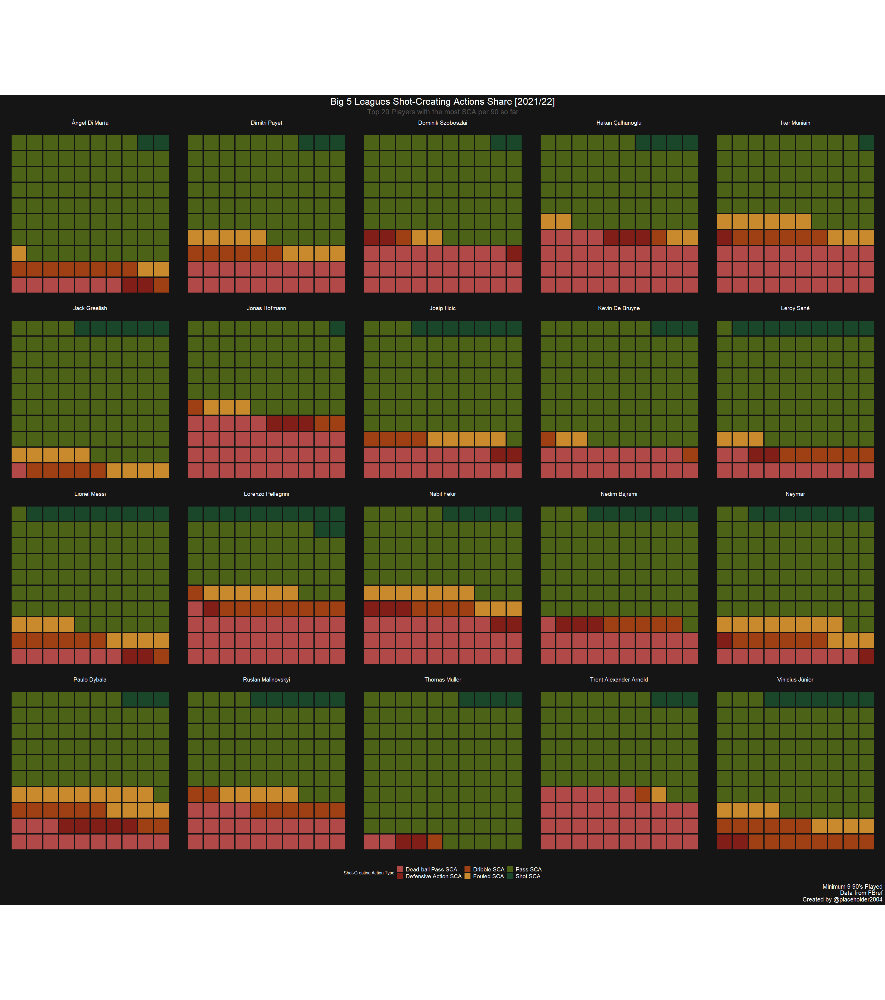

I recently came across a cool waffle viz for the top 20 shot-creating
action players in the big 5 European soccer leagues done by [Harsh
Krishna](https://twitter.com/placehoIder2004) on Twitter, see [original
Tweet
here](https://twitter.com/placehoIder2004/status/1480136784021393409).
He also posted the code [in this Github
gist](https://github.com/harshkrishna17/R-Code/blob/main/Waffle.R) with
a call for help in solving an issue he was having with the preserving
the sum of a group of metrics after rounding the individual metrics to
integers. **Below is the code he posted in full.** The problem in
particular is after the second `for` loop where he rounds the metrics,
he finds that the sum of the metrics don’t add up to 100(%). His way of
resolving this was choosing the `Sh_SCA` variable and trying to
manipulate the values in that metric until the total summed back up to
100.

``` r
# Harsh Krishna `@placeholder2004`
# https://github.com/harshkrishna17/R-Code/blob/main/Waffle.R
# Libraries

library(tidyverse)
library(worldfootballR)
library(ggtext)
library(extrafont)
library(waffle)
library(MetBrewer)

# Scraping

data <- fb_big5_advanced_season_stats(season_end_year = 2022, stat_type = "gca", team_or_player = "player")

# Data Wrangling 

data1 <- data %>%
  filter(Mins_Per_90 >= 9) %>%
  select(Player, Mins_Per_90, SCA90_SCA, SCA_SCA, PassLive_SCA, PassDead_SCA, Drib_SCA, Sh_SCA, Fld_SCA, Def_SCA)

data1 <- data1[order(as.numeric(data1$SCA90_SCA),decreasing = TRUE),]
data1 <- data1[c(1:20),]

df <- data1[order(as.numeric(data1$SCA90_SCA),decreasing = TRUE),]
df <- df[c(1:20),]

Player <- data1$Player
Mins <- data1$Mins_Per_90
data1 <- subset(data1, select = -c(Player, Mins_Per_90, SCA90_SCA))

for(i in 1:ncol(data1)) {
  data1[, i] <- data1[, i] / Mins
}

SCA <- data1$SCA_SCA 

for(i in 1:ncol(data1)) {
  data1[, i] <- round((data1[, i] / SCA) * 100, 0)
}

data1 <- data1 %>%
  mutate(Total = PassLive_SCA + PassDead_SCA + Drib_SCA + Sh_SCA + Fld_SCA + Def_SCA)

## run this ifelse statement as many times as necessary until the Total comes out to be a 100 for all rows.
data1 <- data1 %>% mutate(Sh_SCA = ifelse(Total == 100, Sh_SCA,
                                          ifelse(Total < 100, Sh_SCA + 1,
                                                 ifelse(Total > 100, Sh_SCA - 1, NA)))) %>% 
  mutate(Total = PassLive_SCA + PassDead_SCA + Drib_SCA + Sh_SCA + Fld_SCA + Def_SCA)

data1$Player <- Player 

data1 <- data1 %>%
  pivot_longer(!Player, values_to = "SCAp90", names_to = "SCATypes") %>%
  filter(!SCATypes == "SCA_SCA") %>%
  filter(!SCATypes == "Total") %>%
  count(Player, SCATypes, wt = SCAp90)

data1$Player <- factor(data1$Player, levels = print(df$Player))

# Custom theme function

theme_athletic <- function() {
  theme_minimal() +
    theme(plot.background = element_rect(colour = "#151515", fill = "#151515"),
          panel.background = element_rect(colour = "#151515", fill = "#151515")) +
    theme(plot.title = element_text(colour = "white", size = 24, family = "Fried Chicken Bold", hjust = 0.5),
          plot.subtitle = element_markdown(colour = "#525252", size = 18, hjust = 0.5),
          plot.caption = element_text(colour = "white", size = 15, hjust = 1),
          axis.title.x = element_text(colour = "white", face = "bold", size = 14),
          axis.title.y = element_text(colour = "white", face = "bold", size = 14),
          axis.text.x = element_blank(),
          axis.text.y = element_blank()) +
    theme(panel.grid.major = element_blank(),
          panel.grid.minor = element_blank(),
          panel.background = element_blank()) +
    theme(legend.title = element_text(colour = "white"),
          legend.text = element_text(colour = "white"))
}

# Plotting

data1 %>%
  ggplot(aes(fill = SCATypes, values = n)) +
  geom_waffle(nrows = 10, size = 1.5, colour = "#151515", flip = TRUE) +
  scale_fill_manual(values = met.brewer(name = "Gauguin", n = 6, type = "discrete")) +
  facet_wrap(~Player) +
  labs(title = "Big 5 Leagues Shot-Creating Actions Share [2021/22]",
       subtitle = "Top 20 Players with the most SCA per 90 so far",
       caption = "Minimum 9 90's Played\nData from FBref\nCreated by @placeholder2004") +
  theme_athletic() +
  theme(aspect.ratio = 1,
        strip.background = element_blank(),
        strip.text = element_text(colour = "white", size = 14),
        legend.position = "bottom",
        legend.text = element_text(size = 14))

# Save

setwd("C:/Users/harsh_1mwi2o4/Downloads")
ggsave("wafflebig5.png", width = 3100, height = 3500, units = "px")
```

This is a problem I’ve faced in the past and I’m sure many others have
too, whether in the context of soccer analysis or otherwise. So I
decided to tackle this problem as a fun coding challenge using the
**tidyverse**!

Let’s get started!

Packages
========

I prefer typing out the specific tidyverse packages rather than loading
everything in at once.

``` r
library(dplyr)
library(tidyr)
library(worldfootballR)
library(ggtext)
library(extrafont)
library(waffle)
library(MetBrewer)
```

Scrape data
===========

Get data from FBref/StatsBomb with the {worldfootballR} package.

``` r
# Scraping
data_raw <- fb_big5_advanced_season_stats(season_end_year = 2022, stat_type = "gca", team_or_player = "player")
```

``` r
glimpse(data_raw)
```

    ## Rows: 2,540
    ## Columns: 27
    ## $ X               <int> 1, 2, 3, 4, 5, 6, 7, 8, 9, 10, 11, 12, 13, 14, 15, 16,~
    ## $ Season_End_Year <int> 2022, 2022, 2022, 2022, 2022, 2022, 2022, 2022, 2022, ~
    ## $ Squad           <chr> "Alavés", "Alavés", "Alavés", "Alavés", "Alavés", "Ala~
    ## $ Comp            <chr> "La Liga", "La Liga", "La Liga", "La Liga", "La Liga",~
    ## $ Player          <chr> "Martin Agirregabiria", "Mircea Alexandru Tirlea", "Ru~
    ## $ Nation          <chr> "ESP", "ROU", "ESP", "ARG", "ESP", "ESP", "SWE", "ESP"~
    ## $ Pos             <chr> "DF", "DF", "DF", "MF", "MF", "FW", "FW,MF", "MF", "FW~
    ## $ Age             <chr> "25-249", "21-292", "26-088", "28-293", "24-012", "27-~
    ## $ Born            <int> 1996, 2000, 1995, 1993, 1998, 1994, 1992, 1994, 1990, ~
    ## $ Mins_Per_90     <dbl> 13.6, 0.2, 16.4, 0.6, 7.6, 0.0, 3.0, 0.4, 18.5, 17.9, ~
    ## $ SCA_SCA         <int> 22, 0, 23, 0, 23, 0, 10, 1, 40, 3, 4, 5, 2, 12, 3, 11,~
    ## $ SCA90_SCA       <dbl> 1.62, 0.00, 1.40, 0.00, 3.02, 0.00, 3.28, 2.25, 2.16, ~
    ## $ PassLive_SCA    <int> 16, 0, 11, 0, 12, 0, 5, 1, 24, 0, 4, 3, 2, 10, 1, 6, 4~
    ## $ PassDead_SCA    <int> 2, 0, 9, 0, 8, 0, 0, 0, 1, 2, 0, 1, 0, 0, 0, 0, 18, 0,~
    ## $ Drib_SCA        <int> 1, 0, 0, 0, 1, 0, 1, 0, 1, 0, 0, 1, 0, 2, 0, 1, 1, 0, ~
    ## $ Sh_SCA          <int> 0, 0, 0, 0, 1, 0, 0, 0, 6, 1, 0, 0, 0, 0, 2, 0, 1, 2, ~
    ## $ Fld_SCA         <int> 3, 0, 2, 0, 1, 0, 2, 0, 6, 0, 0, 0, 0, 0, 0, 3, 0, 1, ~
    ## $ Def_SCA         <int> 0, 0, 1, 0, 0, 0, 2, 0, 2, 0, 0, 0, 0, 0, 0, 1, 1, 0, ~
    ## $ GCA_GCA         <int> 2, 0, 3, 0, 0, 0, 3, 0, 5, 1, 0, 1, 0, 0, 0, 3, 3, 0, ~
    ## $ GCA90_GCA       <dbl> 0.15, 0.00, 0.18, 0.00, 0.00, 0.00, 0.99, 0.00, 0.27, ~
    ## $ PassLive_GCA    <int> 1, 0, 0, 0, 0, 0, 1, 0, 2, 0, 0, 1, 0, 0, 0, 1, 1, 0, ~
    ## $ PassDead_GCA    <int> 0, 0, 2, 0, 0, 0, 0, 0, 0, 0, 0, 0, 0, 0, 0, 0, 1, 0, ~
    ## $ Drib_GCA        <int> 1, 0, 0, 0, 0, 0, 0, 0, 0, 0, 0, 0, 0, 0, 0, 0, 0, 0, ~
    ## $ Sh_GCA          <int> 0, 0, 0, 0, 0, 0, 0, 0, 1, 1, 0, 0, 0, 0, 0, 0, 1, 0, ~
    ## $ Fld_GCA         <int> 0, 0, 1, 0, 0, 0, 1, 0, 1, 0, 0, 0, 0, 0, 0, 1, 0, 0, ~
    ## $ Def_GCA         <int> 0, 0, 0, 0, 0, 0, 1, 0, 1, 0, 0, 0, 0, 0, 0, 1, 0, 0, ~
    ## $ Url             <chr> "https://fbref.com/en/players/355c883a/Martin-Agirrega~

Instead of ordering and subsetting with base functions in the original,
I used `arrange()` and `slice()` to grab the top 20 players by SCA per
90.

``` r
# Data Wrangling 
df1 <- data_raw %>%
  filter(Mins_Per_90 >= 9) %>%
  ## use contains() so I don't have to type out every `SCA` variable out
  select(Player, Mins_Per_90, contains("SCA")) %>% 
  ## arrange by SCA per 90 (descending) then take top 20 rows
  arrange(desc(SCA90_SCA)) %>%
  slice(1:20)

glimpse(df1)
```

    ## Rows: 20
    ## Columns: 10
    ## $ Player       <chr> "Dimitri Payet", "Lorenzo Pellegrini", "Hakan Çalhanoglu"~
    ## $ Mins_Per_90  <dbl> 15.4, 13.8, 12.7, 9.2, 12.2, 9.2, 10.3, 9.6, 11.8, 17.3, ~
    ## $ SCA_SCA      <int> 115, 83, 76, 55, 72, 53, 59, 55, 66, 94, 66, 89, 56, 63, ~
    ## $ SCA90_SCA    <dbl> 7.48, 6.02, 5.97, 5.95, 5.88, 5.77, 5.75, 5.72, 5.59, 5.4~
    ## $ PassLive_SCA <int> 71, 34, 41, 35, 40, 34, 44, 37, 52, 50, 45, 43, 43, 36, 3~
    ## $ PassDead_SCA <int> 23, 26, 26, 10, 25, 5, 11, 4, 1, 28, 8, 25, 4, 15, 8, 2, ~
    ## $ Drib_SCA     <int> 7, 7, 1, 2, 2, 3, 1, 4, 3, 6, 4, 4, 5, 5, 5, 1, 13, 1, 1,~
    ## $ Sh_SCA       <int> 3, 10, 3, 4, 1, 4, 2, 5, 4, 1, 6, 4, 1, 4, 2, 3, 6, 3, 1,~
    ## $ Fld_SCA      <int> 11, 5, 3, 3, 2, 6, 1, 4, 6, 8, 2, 9, 2, 3, 8, 0, 7, 1, 1,~
    ## $ Def_SCA      <int> 0, 1, 2, 1, 2, 1, 0, 1, 0, 1, 1, 4, 1, 0, 3, 2, 2, 0, 2, 2

Instead of using a `for` loop to perform the calculations on each
column, I used `mutate()` and then `across()` to specify the columns I
wanted to run the same operation on, dividing the metrics by the number
of minutes that each player played. Also since we are using `mutate()`
we don’t need to pull out the `Mins` variable anymore as we can just
refer to that specific column in the data.frame.

``` r
df2 <- df1 %>% 
  ## use across() to specify which vars to perform operations on
  ## ex. all cols EXCEPT `Player`, `Mins_Per_90`, and `SCA90_SCA`
  mutate(across(-c(Player, Mins_Per_90, SCA90_SCA), ~ . / Mins_Per_90)) 

glimpse(df2)
```

    ## Rows: 20
    ## Columns: 10
    ## $ Player       <chr> "Dimitri Payet", "Lorenzo Pellegrini", "Hakan Çalhanoglu"~
    ## $ Mins_Per_90  <dbl> 15.4, 13.8, 12.7, 9.2, 12.2, 9.2, 10.3, 9.6, 11.8, 17.3, ~
    ## $ SCA_SCA      <dbl> 7.467532, 6.014493, 5.984252, 5.978261, 5.901639, 5.76087~
    ## $ SCA90_SCA    <dbl> 7.48, 6.02, 5.97, 5.95, 5.88, 5.77, 5.75, 5.72, 5.59, 5.4~
    ## $ PassLive_SCA <dbl> 4.610390, 2.463768, 3.228346, 3.804348, 3.278689, 3.69565~
    ## $ PassDead_SCA <dbl> 1.49350649, 1.88405797, 2.04724409, 1.08695652, 2.0491803~
    ## $ Drib_SCA     <dbl> 0.45454545, 0.50724638, 0.07874016, 0.21739130, 0.1639344~
    ## $ Sh_SCA       <dbl> 0.19480519, 0.72463768, 0.23622047, 0.43478261, 0.0819672~
    ## $ Fld_SCA      <dbl> 0.71428571, 0.36231884, 0.23622047, 0.32608696, 0.1639344~
    ## $ Def_SCA      <dbl> 0.00000000, 0.07246377, 0.15748031, 0.10869565, 0.1639344~

Again, here instead of using a `for` loop I used the same
`mutate() + across()` trick again to divide the values by each of the
total SCA types and then multiply that by 100.

What you get now is that all the per 90 stats are in terms of
percentages of the total SCA type.

``` r
df3 <- df2 %>% 
  ## use across() to specify which vars to perform operations on
  ## ex. all cols EXCEPT `Player`, `Mins_Per_90`, and `SCA90_SCA`
  mutate(across(-c(Player, Mins_Per_90, SCA90_SCA), ~ (. / SCA_SCA) * 100 )) %>% 
  mutate(Total = PassLive_SCA + PassDead_SCA + Drib_SCA + Sh_SCA + Fld_SCA + Def_SCA) %>% 
  select(Player, Mins_Per_90, Total, contains("SCA"))

glimpse(df3)
```

    ## Rows: 20
    ## Columns: 11
    ## $ Player       <chr> "Dimitri Payet", "Lorenzo Pellegrini", "Hakan Çalhanoglu"~
    ## $ Mins_Per_90  <dbl> 15.4, 13.8, 12.7, 9.2, 12.2, 9.2, 10.3, 9.6, 11.8, 17.3, ~
    ## $ Total        <dbl> 100, 100, 100, 100, 100, 100, 100, 100, 100, 100, 100, 10~
    ## $ SCA_SCA      <dbl> 100, 100, 100, 100, 100, 100, 100, 100, 100, 100, 100, 10~
    ## $ SCA90_SCA    <dbl> 7.48, 6.02, 5.97, 5.95, 5.88, 5.77, 5.75, 5.72, 5.59, 5.4~
    ## $ PassLive_SCA <dbl> 61.73913, 40.96386, 53.94737, 63.63636, 55.55556, 64.1509~
    ## $ PassDead_SCA <dbl> 20.000000, 31.325301, 34.210526, 18.181818, 34.722222, 9.~
    ## $ Drib_SCA     <dbl> 6.086957, 8.433735, 1.315789, 3.636364, 2.777778, 5.66037~
    ## $ Sh_SCA       <dbl> 2.608696, 12.048193, 3.947368, 7.272727, 1.388889, 7.5471~
    ## $ Fld_SCA      <dbl> 9.565217, 6.024096, 3.947368, 5.454545, 2.777778, 11.3207~
    ## $ Def_SCA      <dbl> 0.000000, 1.204819, 2.631579, 1.818182, 2.777778, 1.88679~

Then I check using `Total` column if the numbers sum to 100. They do, so
we know that these per 90 numbers are good and everything adds up to
100% properly.

For the purpose of making a waffle chart and the fact that you can’t
really “do” 0.43 of a “Shot Creating Action”, we have to turn all of
these values into integers. However, the problem with this is that due
to rounding the individual values, the sum doesn’t equal 100 after the
calculation! Some sums might equal to 99 or 98, some to 100, and some to
101!

Preserve sum after rounding function
====================================

I looked around and tried out a **lot** of different things, not just
different functions but also ways to re-shape the data so that the
algorithm would work correctly. The first function I tried was the
`largeRem()` function [here](https://github.com/basilesimon/largeRem/)
but this only worked for when the sums would add up to -1 (99) or +1
(101) from 100. So I then started manually adding more branches to the
if-else statements but since I knew there had to be something better out
there I moved on. Eventually I found the function below, hoisted from
the
[{JLutils}](https://github.com/larmarange/JLutils/blob/master/R/round_preserve_sum.R)
package that has a pretty good implementation of the **largest
remainder** algorithm:

``` r
round_preserve_sum <- function(x, digits = 0) {
  up <- 10^digits
  x <- x * up
  y <- floor(x)
  indices <- tail(order(x - y), round(sum(x)) - sum(y))
  y[indices] <- y[indices] + 1
  y / up
}
```

I honestly wanted to show how to do **row-wise** operations using the
tidyverse in this section because I got tired of having to pivot back
and forth and back and forth. See
[here](https://dplyr.tidyverse.org/articles/rowwise.html) for how
row-wise operations work in the tidyverse. However, the custom function
I used to preserve the sum wasn’t created to support the tidyverse’s
row-wise method, so I ended up having to transpose the data and
un-transpose it with the pivot functions anyway. At the end, we can
check our work by creating a `Total` variable again to see that
everything sums up to 100 even after rounding all the metrics into
integers!

``` r
df4 <- df3 %>% 
  select(-Mins_Per_90, -SCA90_SCA, -SCA_SCA, -Total) %>% 
  ## transpose
  pivot_longer(cols = -Player) %>% 
  pivot_wider(names_from = Player, values_from = value) %>% 
  ## run function over player column
  mutate(across(-name, ~ round_preserve_sum(.))) %>% 
  ## transpose back to original shape
  pivot_longer(names_to = "Player", values_to = "thing", cols = -name) %>% 
  pivot_wider(names_from = name, values_from = thing) %>% 
  mutate(Total = PassLive_SCA + PassDead_SCA + Drib_SCA + Sh_SCA + Fld_SCA + Def_SCA)

glimpse(df4)
```

    ## Rows: 20
    ## Columns: 8
    ## $ Player       <chr> "Dimitri Payet", "Lorenzo Pellegrini", "Hakan Çalhanoglu"~
    ## $ PassLive_SCA <dbl> 62, 41, 54, 64, 55, 64, 74, 67, 79, 53, 68, 48, 77, 57, 5~
    ## $ PassDead_SCA <dbl> 20, 31, 34, 18, 35, 9, 19, 7, 1, 30, 12, 28, 7, 24, 13, 2~
    ## $ Drib_SCA     <dbl> 6, 9, 1, 4, 3, 6, 2, 7, 5, 6, 6, 4, 9, 8, 8, 1, 14, 1, 1,~
    ## $ Sh_SCA       <dbl> 3, 12, 4, 7, 1, 8, 3, 9, 6, 1, 9, 5, 2, 6, 3, 4, 7, 3, 2,~
    ## $ Fld_SCA      <dbl> 9, 6, 4, 5, 3, 11, 2, 8, 9, 9, 3, 10, 3, 5, 13, 0, 8, 1, ~
    ## $ Def_SCA      <dbl> 0, 1, 3, 2, 3, 2, 0, 2, 0, 1, 2, 5, 2, 0, 5, 2, 2, 0, 3, 3
    ## $ Total        <dbl> 100, 100, 100, 100, 100, 100, 100, 100, 100, 100, 100, 10~


Now all that’s left is to pivot the data based on the different
Shot-Creating Action types so that the data is re-shaped into the format
needed for the waffle plot. I also cleaned up the SCA types so that it
reads nicer on the final plot using the `case_when()` function, which is
like a Super Saiyan version of if-else statements.

``` r
df5 <- df4 %>%
  ## we don't need the `Total` column anymore...
  select(-Total) %>% 
  ## Pivot so that we get the all the SCA types collapsed into a single column
  pivot_longer(!Player, values_to = "SCAp90", names_to = "SCATypes") %>%
  mutate(SCATypes = case_when(
    SCATypes == "Def_SCA" ~ "Defensive Action SCA",
    SCATypes == "Drib_SCA" ~ "Dribble SCA",
    SCATypes == "Fld_SCA" ~ "Fouled SCA",
    SCATypes == "PassDead_SCA" ~ "Dead-ball Pass SCA",
    SCATypes == "PassLive_SCA" ~ "Pass SCA",
    SCATypes == "Sh_SCA" ~ "Shot SCA",
    TRUE ~ SCATypes
  )) %>% 
  count(Player, SCATypes, wt = SCAp90)

glimpse(df5)
```

    ## Rows: 120
    ## Columns: 3
    ## $ Player   <chr> "Ángel Di María", "Ángel Di María", "Ángel Di María", "Ángel ~
    ## $ SCATypes <chr> "Dead-ball Pass SCA", "Defensive Action SCA", "Dribble SCA", ~
    ## $ n        <dbl> 7, 2, 9, 3, 77, 2, 20, 0, 6, 9, 62, 3, 29, 3, 1, 2, 63, 2, 34~

‘The Athletic’ Theme
====================

I do feel that the subtitle should pop out a bit more, but I want to
preserve the original as much as possible so I won’t change anything
here…!

``` r
theme_athletic <- function() {
  theme_minimal() +
    theme(plot.background = element_rect(colour = "#151515", fill = "#151515"),
          panel.background = element_rect(colour = "#151515", fill = "#151515")) +
    theme(plot.title = element_text(colour = "white", size = 24, family = "Fried Chicken Bold", hjust = 0.5),
          plot.subtitle = element_markdown(colour = "#525252", size = 18, hjust = 0.5),
          plot.caption = element_text(colour = "white", size = 15, hjust = 1),
          axis.title.x = element_text(colour = "white", face = "bold", size = 14),
          axis.title.y = element_text(colour = "white", face = "bold", size = 14),
          axis.text.x = element_blank(),
          axis.text.y = element_blank()) +
    theme(panel.grid.major = element_blank(),
          panel.grid.minor = element_blank(),
          panel.background = element_blank()) +
    theme(legend.title = element_text(colour = "white"),
          legend.text = element_text(colour = "white"))
}
```

Plot
====

Not much needs to be changed here again, I just cleaned the legend title
a bit.

**NOTE**: The players in the plot changed because, well, there’s been
plenty of football since the [original viz was
posted](https://twitter.com/placehoIder2004/status/1480136784021393409)!

``` r
wafplot <- df5 %>%
  ggplot(aes(fill = SCATypes, values = n)) +
  geom_waffle(nrows = 10, size = 1.5, colour = "#151515", flip = TRUE) +
  scale_fill_manual(values = met.brewer(name = "Gauguin", n = 6, type = "discrete"),
                    name = "Shot-Creating Action Type") +
  facet_wrap(~Player) +
  labs(title = "Big 5 Leagues Shot-Creating Actions Share [2021/22]",
       subtitle = "Top 20 Players with the most SCA per 90 so far",
       caption = "Minimum 9 90's Played\nData from FBref\nCreated by @placeholder2004") +
  theme_athletic() +
  theme(aspect.ratio = 1,
        strip.background = element_blank(),
        strip.text = element_text(colour = "white", size = 14),
        legend.position = "bottom",
        legend.text = element_text(size = 14))
wafplot
```

    ## Warning in grid.Call(C_stringMetric, as.graphicsAnnot(x$label)): font family not
    ## found in Windows font database

    ## Warning in grid.Call(C_textBounds, as.graphicsAnnot(x$label), x$x, x$y, : font
    ## family not found in Windows font database

    ## Warning in grid.Call(C_textBounds, as.graphicsAnnot(x$label), x$x, x$y, : font
    ## family not found in Windows font database

    ## Warning in grid.Call(C_textBounds, as.graphicsAnnot(x$label), x$x, x$y, : font
    ## family not found in Windows font database



I’ve just added the call to `here::here()`, a force of habit to keep
file paths relative to the project root directory. Typing out the entire
path is an annoyance so you can just do this to avoid it. Also helps
when you move projects to a different computer or you’re collaborating
using somebody else’s code, you don’t have to re-type
`C:/Users/blahblah/blahblah/...` all the time.

``` r
ggsave(plot = wafplot, filename = here::here("Europe 2021-2022/output/big5_SCA_waffle_plot.png"), 
       width = 3100, height = 3500, units = "px")
```

…and done!

So this was a very short blog post on finding a solution to the
“preserve sum after rounding” problem as well as re-writing some of the
code to fit my coding style using the tidyverse. Just to be clear, aside
from the main problem, none of the code in the original script was
wrong! At the end of the day, it worked and a great viz was created, so
there obviously was no problem at all. I hope the way I did it shows
people there are different ways to approach a problem and that you
learned about a couple of new functions and tricks along the way!

I spent about 1\~2 hours on this and most of it was googling for
different solutions and finding documentation which goes to show how
important being able to search for the right things on the internet is
for programming in general. You’re never going to be able to memorize
everything you’ve ever done, so being good at googling is paramount.
Being able to look up stuff efficiently is a skill that needs to be
mastered, so things like taking on coding challenges I see in the wild
(like the problem presented in this blog post) or taking part in
community challenges like \#TidyTuesday can help you gain valuable
experience.


Of course, there are also other ways to crystallize knowledge such as …
writing a blog post about an interesting problem!

Special thanks to Harsh Krishna for sharing the code to his beautiful
data viz. Hope this blog post was useful to everyone!

<center>
<script type='text/javascript' src='https://storage.ko-fi.com/cdn/widget/Widget_2.js'></script>
<script type='text/javascript'>kofiwidget2.init('Buy Me A Coffee!', '#29abe0', 'O4O342A2A');kofiwidget2.draw();</script>
<center/>
